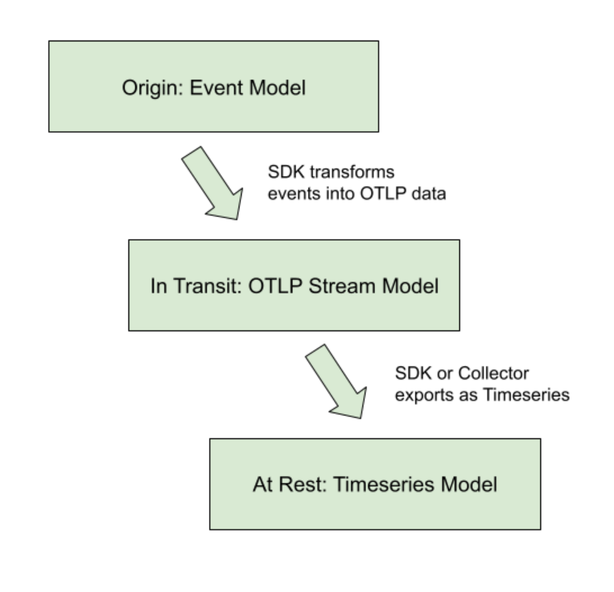
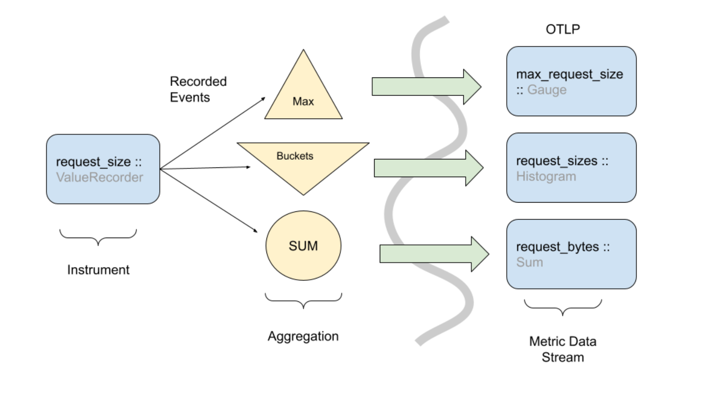

+++

author = "旅店老板"
title = "OpenTelemetry原理概览"
date = "2024-08-03"
description = "介绍OpenTelemetry中OpenTracing，OpenMetrics，Log的数据模型, 了解多种可观测性数据如何产生关联"
tags = [
	"OpenTelemetry"
]
categories = [
    "OpenTelemetry"
]
series = [""]
aliases = ["OpenTelemetry"]
image = "OpenTelemetry.png"
mermaid = true
+++

## OpenTelemetry
OpenTelemetry简称OTel,是各类API、SDK和工具形成的集合。可用于插桩、生成、采集和导出遥测数据（链路、指标和日志），帮助分析软件的性能和行为。
OpenTracing、OpenCensus、OpenMetrics 
### 组成
OpenTelemetry架构有Signals组成，每个Signal都提供一种可观测性。Signals有多种类型:
* Tracing Signal: 分布式追踪
* Metric Signal: 指标监控
* Log Signal: 日志
* Baggage Signal: 上下文透传
### 孤立的可观测性

目前大多数应用的可观测性实现是使用上图的方式。

* 日志: 使用`Logging Library`格式化日志数据，使用FileBeat、Logstash等将日志上报到ES中，最后通过Graylog、Kibana等可视化工具进行展示和搜索。
* 追踪：使用`Tracing Library`格式化链路追踪数据,使用Jaeger Agent等进行数据上报到Jaeger,最终通过Jaeger进行展示。
* 指标: 使用`Metric Library`格式化数据,采用推或拉的方式将数据存储到Prometheus,最终通过Grafana可视化工具进行展示。

上述过程中存在一些问题,应用中引入了三个**不同Library**,它们的规范可能是不一样的,因此它们的数据模型**关联性也较弱**。
使用者很难直接将这三种不同的数据联合使用,比如从异常日志直接跳转到对应的链路追踪等。

### OpenTelemetry标准下的可观测性

采用一种遵循标准的Library,将多种类型的观测数据进行同意处理,不管最终储存数据是一个后端还是多个后端,数据与数据之间是有关联性的。  
Span

## Trace
### OpenTracing
OpenTracing于2016年10月加入CNCF基金会，是继Kubernetes和Prometheus之后，第三个加入CNCF的开源项目。下面用一个示例开启我们对OpenTracing的学习。  

在分布式场景下,用户从前端产生的一个行为(下单、付款等等),这个行为会调用多个服务,每个服务中有多个不同逻辑段,每个逻辑段能拆分出多个更小的逻辑段。
每个逻辑段可以称为操作,用`Span`来描述,子逻辑段即子操作就可以用`子Span`来描述。  
比如一个付款可以细分为两个逻辑段:查询余额是否充足和扣除余额。这两个操作名称不同,但它们属于同一级，查询余额还可以细分查询充值点数和查询折扣点数,这两个操作是一个子操作。  

`Span`是OpenTracing标准的核心概念之一,它的结构如下:
```go
type Span struct {
	spanContext SpanContext
	
	operationName string
	
	firstInProcess bool
	
	startTime time.Time
	
	duration time.Duration
	
	tags []Tag
	
	logs []opentracing.LogRecord
}
```
* **operationName**:操作名称。  
* **firstInProcess**：可以表示该span是否是链路中第一个操作。  
* **startTime**:操作开始时间。  
* **duration**：操作耗时。  
* **tags**:一个tag数组,tag由键值对组成,可以存储用户名、订单号等,具体描述这个链路的参与者信息。  
* **logs**: 与span关联的内嵌日志
* **spanContext**:也是OpenTracing标准的核心概念。  

spanContext从名称可知记录的是上下文信息，它需要在调用链路中进行传递。比如一个操作的多个子操作是调用不同的服务。在另一个服务中记录子操作时我们应该能知道关联的父操作。`SpanContext`的定义如下:
```go
type SpanContext struct {
	traceID TraceID
	
	spanID SpanID
	
	parentID SpanID
	
	baggage map[string]string
	
	remote bool
}
```
* **traceID**:链路追踪的核心参数,全局唯一值用来串联一个完整的调用链路
* **spanID**:当前操作的id，在一次调用链路中唯一。
* **parentID**:记录父操作id
* **baggage**：用于在全链路透传一些信息,比如多租户系统的租户ID
* **remote**:记录当前操作是否是远程操作(即跨服务调用)，为true表示父操作发生在另一个服务中

综上可知,我们大致了解了一个**Span**需要记录哪些信息。


从图中可以看出trace有两个主要的数据流向：服务之间的调用需要传递信息,称之为带内数据(**in-band data**),每个服务有对应Trace Agent采集数据,称之为带外数据(**out-of-band data**),最终存储到一个后端。  

根据前面的介绍,我们能较清晰地知道**in-band data**和**out-of-band data**具体是什么数据。

Trace Agent的形式多种多样,可以是一个独立的进程,也可以直接集成到业务进程中。  


***
### Trace采样策略
* 头部采样：在入口处标识这个trace是否需要采样
* 尾部采样: 将调用链路地操作先缓存,调用完成时确定是否需要采样,这种方式对内存消耗较大
* 单元采样:某个服务的节点耗时高需进行采样，不管链路的其他节点是否需要采样。
* 其他维度采样:指定某用户必须进行全链路采样
***
## Metric
### 指标计量器
在OpenTelemetry中,测量值由计量器(**metric instruments**)捕获，一个计量器(**metric instrument**)的定义如下:
* Name
* Kind
* Unit (optional)
* Description (optional)

Name、Unit和Description由开发人员选择，或通过常用的[语义约定](https://opentelemetry.io/docs/specs/semconv/general/metrics/)进行定义  

计量器的**kind**为一下之一:
* **Counter**: 随着时间的推移而累积的值,比如汽车上的里程表;它只会上升。
* **Asynchronous Counter**: 适用于间歇性收集数据的情况。是由系统在后台自动收集数据，而不是在应用代码中显式调用，例如服务的请求总数。
* **UpDownCounter**:一个随时间推移增加或减少的值。比如系统中当前活跃连接数。
* **Asynchronous UpDownCounter**:适用于间歇性收集数据的情况，比如队列中的待处理任务数
* **Gauge**:在读取时测量当前值。类似于车辆的燃油表。Gauges是异步的。比如系统的CPU
* **Histogram**:客户端的值聚合，适用于测量一系列数据点的分布情况。比如多少请求耗时少于1秒
***
### 指标规范
#### Attribute
OpenTelemetry允许使用预定义的聚合和一组属性(**Attribute**)记录原始测量值或指标。  

在 OpenTelemetry 中，属性(Attribute)是一个键值对，必须具备以下属性：
* attribute key: 
  * 属性键必须是非空字符串，并且不能为 null
  * 键的大小写敏感，即大小写不同的键会被视为不同的键。
* attribute value: 
  * 属性值可以是以下几种原始类型之一：
      * 字符串 (string)
      * 布尔值 (boolean)
      * 双精度浮点数 (double precision floating point, IEEE 754-1985)
      * 有符号64位整数 (signed 64 bit integer)
  * 属性值也可以是原始类型值的数组。这些数组必须是同质的，即不能包含不同类型的值。
***
#### 协议支持
对于不原生支持非字符串值的协议，非字符串值应该表示为 JSON 编码的字符串。比如int64(100)会被编码为 "100"，float64(1.5)会被编码为 "1.5"，任何类型的空数组会被编码为"[]"
***
#### 有意义的值
表示数值零、空字符串或空数组的属性值被认为是有意义的，必须存储并传递给处理器/导出
***
#### 无效值
* **null**值是无效的，尝试设置**null**值的行为是未定义的。
* 无法确保传递的不是null值时，比如些编程语言中，可能没有适当的编译时类型检查，导致不能确保数组中没有null值,在这种情况下，如果数组中出现了null值，这些null值必须按原样保留，即继续传递给跨度处理器或导出器，而不是在传递前移除或更改。
* 果导出器（即处理数据的组件）不支持导出null值，它们可以用以下值来替换null
  * 数字 0
  * 布尔值 false
  * 空字符串 ""
* 属性数组用于表示映射或字典结构时,比如用两个同步索引的数组header_keys和header_values表示键值对映射，header_keys[i]对应header_values[i],为了保持这种映射关系，即使数组中存在 null 值，它们也必须保留。这是为了确保索引的同步和映射关系的正确性

[Attribute命名规范](https://opentelemetry.io/docs/specs/semconv/general/attribute-naming/)
***
### 数据模型
OTLP Metrics协议被设计为传输指标的标准数据,它将指标分割为三个交互模型。
* 事件模型(Event Model)，表示检测如何报告指标数据。
* 指标流模型(Metric Stream Model)，定义OpenTeLemetry Protocol （OTLP表示如何在指标数据流之间操作和传输事件模型和Timeseries存储。
* 时间序列模型(Timeseries model)，表示后端如何存储指标数据。 
****

事件 => 数据流 => 时间序列,`=>`代表数据流向，如下图所示:

#### 事件模型
事件模型是记录数据的地方,指标计量器通过事件记录数据观测。然后，这些原始事件以某种方式进行转换,再被发送到其他系统。OpenTelemetry 指标的设计使得相同的事件可以以不同的方式用于生成指标流。  


上图显示了一种工具如何将事件转换为多种类型的指标流。  

Event记录了每个请求的大小,`ValueRecorder`是一个分组聚合的指标计量器(metric instrument),它通过取最值、求和、分桶将Event转换为了三种指标流模型(Metric Stream Model):
`Gauge`、`Histogram`和`Sum`
> 转换的一些注意事项和细微差别请查看[指标API规范](https://opentelemetry.io/docs/specs/otel/metrics/api/)
> 
> API也有确切的计量器规范，请查看[OpenTelemetry instruments](https://opentelemetry.io/docs/specs/otel/metrics/api/#instrument)

***
#### 时间序列模型
在此低级指标数据模型中，Timeseries由实体定义,由多个元数据属性组成：
* Metric name: 指标名称
* Attributes (dimensions): 属性（维度）
* Value type of the point (integer, floating point, etc): 点的值类型（整数、浮点数等）
* Unit of measurement: 计量单位

**每个时间序列的主要数据是有序的（时间戳、值）点**，其中 以下值类型之一：
*  Counter (Monotonic, Cumulative): 计数器（单调性、累积性）
*  Gauge: 
*  Histogram: 直方图
*  Exponential Histogram: 指数直方图
***
## Log
Log在OpenTelemetry好像还没有明确的标准。
### 数据模型
| Field Name     | Description                               |
|----------------|-------------------------------------------|
| Timestamp      | 事件发生的时间。         |
| TraceId        | 请求跟踪 ID。                        |
| SpanId         | 请求跨度 ID。                        |
| TraceFlags     | W3C 跟踪标志。                          |
| SeverityText   | 严重性文本（也称为日志级别）。 |
| SeverityNumber | 严重性的数值。        |
| Name           | 	短事件标识符。                  |
| Body           | 日志记录的正文。             |
| Resource       | 	描述日志的源。         |
| Attributes     | 有关事件的其他信息。  |
* **Timestamp**
  * 类型：时间戳，自Unix纪元以来的uint64纳秒。
  * 描述：事件发生的时间，由原始时钟测量。这 字段是可选的，如果时间戳未知，则可能会丢失。
* **TraceId**
  * 类型：字节序列。
  * 描述：[W3C跟踪上下文](https://www.w3.org/TR/trace-context/#trace-id) 中定义的请求跟踪 ID。可设定 对于属于请求处理的一部分并具有分配的跟踪 ID 的日志。这 字段是可选的。
* **SpanId**
  * 类型：字节序列。
  * 描述：跨度 ID。可以为属于特定内容的日志进行设置 处理跨度。如果 SpanId 存在，则 TraceId 也应存在。此字段 是可选的。
* **TraceFlags**
  * 类型：字节。
  * 描述：[W3C跟踪上下文](https://www.w3.org/TR/trace-context/#trace-flags) 规范中定义的跟踪标志。在撰写本文时，规范定义了一个标志 - SAMPLED 标志。此字段是可选的。
* **SeverityText**
  * 类型：字符串。
  * 描述：严重性文本（也称为日志级别）。这是原始的 在源中已知的严重性的字符串表示形式。如果这个 字段缺失，并且存在，然后是短名称 对应于可以用作替代物。此字段是 自选。
* **SeverityNumber**
  * 类型：数字。
  * 描述：严重性的数值，此字段是可选的。
  
    | SeverityNumber 范围 | 范围名称 | 意义                                              |
    |----------------------|----------|---------------------------------------------------|
    | 1-4                  | TRACE     | 细粒度的调试事件。通常在默认配置中禁用。          |
    | 5-8                  | DEBUG     | 调试事件。                                        |
    | 9-12                 | INFO     | 信息性事件。指示发生了事件。                      |
    | 13-16                | WARN     | 警告事件。不是错误，但可能比信息事件更重要。      |
    | 17-20                | ERROR     | 错误事件。出了点问题。                            |
    | 21-24                | FATAL     | 致命错误，例如应用程序或系统崩溃。                |

   每个范围内的数值越小，表示重要性越低（严重程度越低） 事件。每个范围内的数值越大，表示越重要（更严重）事件。


* **Name**
  * 类型：字符串。
  * 描述：不包含可变部分的短事件标识符。推荐不超过50个字符,此字段是可选的。
* **Body**
  * 类型：任意。
  * 描述：包含日志记录正文的值,可以是人类可读的字符串消息（包括多行）以自由形式描述事件，也可以是由数组和其他值的映射组成的结构化数据。
* **Resource**
  * 类型：键/值对列表。
  * 描述：描述日志的源,应遵循Resources的OpenTelemetry语义约定。 此字段是可选的。
* **Attributes**
  * 类型：键/值对列表。
  * 描述：有关特定事件发生的其他信息。每个源的字段可能会有所不同,来自同一来源的事件的发生。可以包含信息 关于请求上下文（TraceId/SpanId 除外）。应遵循Attributes的OpenTelemetry语义约定。此字段是可选的。


数据模型中不定义日志记录的实际编码和格式 表示法。格式定义将在单独的 OTEP 中完成（例如日志 记录可以表示为 msgpack、JSON、Protocol Buffer 消息等）。
 
示例:
```json
{
  "Timestamp": 1586960586000, // JSON needs to make a decision about
                              // how to represent nanoseconds.
  "Attributes": {
    "http.status_code": 500,
    "http.url": "http://example.com",
    "my.custom.application.tag": "hello",
  },
  "Resource": {
    "service.name": "donut_shop",
    "service.version": "semver:2.0.0",
    "k8s.pod.uid": "1138528c-c36e-11e9-a1a7-42010a800198",
  },
  "TraceId": "f4dbb3edd765f620", // this is a byte sequence
                                 // (hex-encoded in JSON)
  "SpanId": "43222c2d51a7abe3",
  "SeverityText": "INFO",
  "SeverityNumber": 9,
  "Body": "20200415T072306-0700 INFO I like donuts"
}
```
***
## 相关性
Logs和Traces可以通过traceid关联跳转  

Metric如何跳转Traces？ exemplar字段


