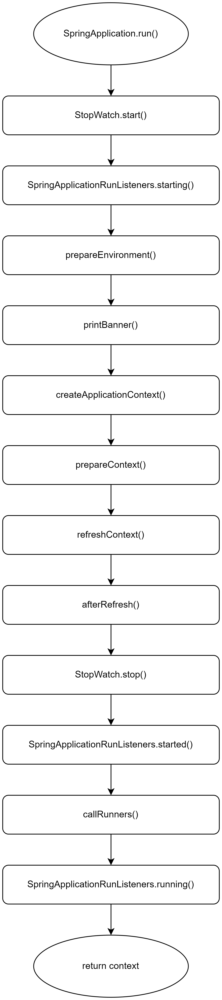

+++

author = "旅店老板"
title = "SpringBoot原理(三):启动流程分析"
date = "2023-05-27"
description = "关于SpringBoot启动流程地详细源码分析"
tags = [
	"SpringBoot",
]
categories = [
"java",
"SpringBoot"
]
series = [""]
aliases = ["migrate-from-jekyl"]
image = "SpringBoot.png"
mermaid = true

+++
# Spring Boot启动流程
## 开始之前
* 需要SpringBoot的demo项目，用于验证自动配置
* 需要熟悉java注解的相关的知识
* SpringBoot 2.2.13RELEASE的源码调试环境(该文章所使用的源码都来自该版本)  
  下载地址为：[https://github.com/spring-projects/spring-boot/tree/v2.2.13.RELEASE](https://github.com/spring-projects/spring-boot/tree/v2.2.13.RELEASE)
***
## SpringBoot启动类
* 运行SpringBoot
  众所周知，当我们想运行一个SpringBoot项目时，只需要引入相关依赖，再编写一个启动类，并给这个启动类标上`@SpringBootApplication`注解，就可以启动项目了
  ，代码如下所示:
```java
@SpringBootApplication
public class TestApplication {

    public static void main(String[] args) {
        SpringApplication.run(TestApplication.class, args);
    }

}
```
`main`方法中仅仅调用了`SpringApplication.run(TestApplication.class, args);`就完成了SpringBoot启动流程，非常简单。
***
* `@SpringBootApplication`注解源码如下:
```java
@SpringBootConfiguration
@EnableAutoConfiguration
@ComponentScan(excludeFilters = { @Filter(type = FilterType.CUSTOM, classes = TypeExcludeFilter.class),
		@Filter(type = FilterType.CUSTOM, classes = AutoConfigurationExcludeFilter.class) })
public @interface SpringBootApplication {

	@AliasFor(annotation = EnableAutoConfiguration.class)
	Class<?>[] exclude() default {};//等同于EnableAutoConfiguration注解的exclude属性

	@AliasFor(annotation = EnableAutoConfiguration.class)
	String[] excludeName() default {};//等同于EnableAutoConfiguration注解的excludeName属性

	@AliasFor(annotation = ComponentScan.class, attribute = "basePackages")
	String[] scanBasePackages() default {};//等同于ComponentScan注解的basePackages属性

	@AliasFor(annotation = ComponentScan.class, attribute = "basePackageClasses")
	Class<?>[] scanBasePackageClasses() default {};//等同于ComponentScan注解的basePackageClasses属性
	
	@AliasFor(annotation = Configuration.class)
	boolean proxyBeanMethods() default true;//等同于SpringBootConfiguration注解的元注解@Configuration的proxyBeanMethods属性
}
```
`@SpringBootApplication`注解有三个元注解:`@SpringBootConfiguration`、`@EnableAutoConfiguration`、`@ComponentScan`，`@SpringBootApplication`注解的属性有别名注解修饰，
通过之前的文章，我们已经知道了别名注解`@AliasFor`的作用，并且已经分析了`@EnableAutoConfiguration`注解
***
* `SpringApplication.run();`的源码如下:
```java
    public static ConfigurableApplicationContext run(Class<?> primarySource, String... args) {
        return run(new Class[]{primarySource}, args);
    }
```
执行了`run`方法,primarySource入参是我们传入的启动类的class,`run`方法源码如下:
```java
    public static ConfigurableApplicationContext run(Class<?>[] primarySources, String[] args) {
        return (new SpringApplication(primarySources)).run(args);
    }
```
创建了一个类`SpringApplication`的实例，入参primarySources使我们传入的启动类的class数组，并且调用了该实例的`run`方法，入参为args,args是我们自定义传入的参数。  
primarySources使用如下方式存储到实例的对应字段，像这样`this.primarySources = new LinkedHashSet(Arrays.asList(primarySources));`
***
* `SpringApplication`的实例的`run`方法就是SpringBoot启动的核心实现，源码及注释如下:
```java
	public ConfigurableApplicationContext run(String... args) {
		//StopWatch用于统计run启动过程花了多少时间
		StopWatch stopWatch = new StopWatch();
		//开始计时
		stopWatch.start();
		ConfigurableApplicationContext context = null;
		//exceptionReporters存储异常报告器
		Collection<SpringBootExceptionReporter> exceptionReporters = new ArrayList<>();
		//配置java.awt.headless,使服务器检测不到显示器仍正常启动
		configureHeadlessProperty();
		//【1】从META-INF/spring.factories中获取SpringApplicationRunListener的集合
		SpringApplicationRunListeners listeners = getRunListeners(args);
		//【2】遍历listener开启监听，实际类型为EventPublishingRunListener
		listeners.starting();
		try {
			//创建ApplicationArguments对象，封装了自定义args参数
			ApplicationArguments applicationArguments = new DefaultApplicationArguments(args);
			//准备environment变量
			ConfigurableEnvironment environment = prepareEnvironment(listeners, applicationArguments);
			//如果JVM系统属性spring.beaninfo.ignore为空，则从environment中获取(可能是在application.yml中)，
			// 默认为true，并赋值给JVM系统属性spring.beaninfo.ignore，这个与内省机制和javaBean有关，
			// javaBean的规范有无参构造、getter、setter等
			configureIgnoreBeanInfo(environment);
			//控制台打印SpringBoot的bannner标志，可以配置不打印，获取的是banner.txt和banner.gif，就是SpringBoot启动时打印的那个logo
			Banner printedBanner = printBanner(environment);
			//【2】根据webApplicationType类型加载不同的contenxt，如果是servlet则加载AnnotationConfigServletWebServerApplicationContext
			context = createApplicationContext();
			//【3】从我们熟悉的缓存cache获取SpringBootExceptionReporter的类路径集合，循环通过反射创建实例
			//cache是个静态变量，没有就从META-INF/spring.factories加载
			exceptionReporters = getSpringFactoriesInstances(SpringBootExceptionReporter.class,
					new Class[] { ConfigurableApplicationContext.class }, context);
			//为刚创建的AnnotationConfigServletWebServerApplicationContext进行一些初始化工作
			//1.赋值context的environment、reader、scanner，都与传入的environment有关
			//2.做一些后置处理，比如BeanFactory注册一个单例org.springframework.context.annotation.internalConfigurationBeanNameGenerator
			//设置context的resourceLoader属性
			//3.【4】在context刷新前调用各个ApplicationContextInitializer的初始化方法，从我们熟悉的缓存cache中获取，没有则从META-INF/spring.factories加载
			//4.注册springApplicationArguments(自定义入参applicationArguments)和springBootBanner(logo标志)，所谓注册就是存入singletonObjects这个map，
			//map的key为springApplicationArguments、springBootBanner字符串，值就是我们传入的applicationArguments、printedBanner
			//5.【5】加载从最外层传入的标有@SpringBootApplication注解的启动类
			prepareContext(context, environment, listeners, applicationArguments, printedBanner);
			//刷新context
			//1.注册jvm的hook钩子，Runtime.getRuntime().addShutdownHook(this.shutdownHook);，当所有钩子执行完才关闭jvm
			//主要逻辑是context.doClose(),包括clear各种缓存，清除beanFactory，关闭webServer等
			//2.【6】****
			refreshContext(context);
			//刷新context的后置处理，这里源码是空方法，无实现逻辑
			afterRefresh(context, applicationArguments);
			//停止计时,可以通过stopWatch.getTotalTimeMillis()获取耗时
			stopWatch.stop();
			if (this.logStartupInfo) {
				new StartupInfoLogger(this.mainApplicationClass).logStarted(getApplicationLog(), stopWatch);
			}
			//推送ApplicationStartedEvent事件，标志context已刷新完成，所有bean实例都已加载完成
			listeners.started(context);
			//获取ApplicationRunner和CommandLineRunner执行对应的run方法
			callRunners(context, applicationArguments);
		}
		catch (Throwable ex) {
			//推送ApplicationFailedEvent事件，标志SpirngBoot启动失败
			//exceptionReporters用于报告异常
			handleRunFailure(context, ex, exceptionReporters, listeners);
			throw new IllegalStateException(ex);
		}

		try {
			//推送ApplicationReadyEvent事件，标志SpringApplication启动成功，可以接受请求了
			listeners.running(context);
		}
		catch (Throwable ex) {
			handleRunFailure(context, ex, exceptionReporters, null);
			throw new IllegalStateException(ex);
		}
		return context;
	}
```
`run`方法是SpringBoot启动的核心函数，每行代码都有许多注释,请根据自己的源码调试环境进行对照阅读
## run方法源码分析
该章节会对上面`run`方法带有【】的注释进行重点分析
* 【1】`SpringApplicationRunListeners listeners = getRunListeners(args);`,注释为从META-INF/spring.factories中获取SpringApplicationRunListener的集合

具体逻辑是从一个缓存cache中查询，没有则从META-INF/spring.factories中加载，是不是对这个逻辑比较熟悉呢?我们已多次遇到

`getRunListeners`的源码如下：
```java
	private SpringApplicationRunListeners getRunListeners(String[] args) {
		Class<?>[] types = new Class<?>[] { SpringApplication.class, String[].class };
		return new SpringApplicationRunListeners(logger,
				getSpringFactoriesInstances(SpringApplicationRunListener.class, types, this, args));
	}
```
`new SpringApplicationRunListeners`只是将listeners参数赋值并返回，核心在于`getSpringFactoriesInstances(SpringApplicationRunListener.class, types, this, args)`,传入了
一个`SpringApplicationRunListener.class`,一个`types`具体为`SpringApplication.class`、`String[].class`的数组,
还传入了`this`,`this`就是SpringApplication实例，最后传入自定义args参数，记住这个几个参数,后面会通过这几个参数创建SpringApplicationRunListener实例，细节源码实现如下：
 ```java
	private <T> Collection<T> getSpringFactoriesInstances(Class<T> type, Class<?>[] parameterTypes, Object... args) {
		//获取classLoader
		ClassLoader classLoader = getClassLoader();
		// Use names and ensure unique to protect against duplicates
		//set进行去重，值为完成的类路径
		Set<String> names = new LinkedHashSet<>(SpringFactoriesLoader.loadFactoryNames(type, classLoader));
		//根据反射创建对应实例
		List<T> instances = createSpringFactoriesInstances(type, parameterTypes, classLoader, args, names);
		//从小到大排序，如果1个类实现了PriorityOrdered接口，另一个类没有实现，那么实现的类排前面
		//如果都实现了PriorityOrdered接口，或者都没有实现，那么就要根据order值从小到大排序。order值的获取方式有3种，
		// 并且有优先级顺序，Ordered接口（@PriorityOrdered是继承Ordered接口的）> @Order注解 > @Priority，程序只会获取优先级最高的order值。
		// 比如既实现了Ordered接口又实现了@Order注解，程序只会取Ordered接口的order值。如果都没有实现，就返回Integer.MAX_VALUE
		AnnotationAwareOrderComparator.sort(instances);
		return instances;
	}
```
该方法逻辑都比较简单，通过`SpringFactoriesLoader.loadFactoryNames(type, classLoader)`获取我们需要的类路径集合，其源码如下：
```java
public static List<String> loadFactoryNames(Class<?> factoryType, @Nullable ClassLoader classLoader) {
        String factoryTypeName = factoryType.getName();
        return (List)loadSpringFactories(classLoader).getOrDefault(factoryTypeName, Collections.emptyList());
    }
```
此时`factoryTypeName`的值是`org.springframework.boot.SpringApplicationRunListener`,我们接着往下看`loadSpringFactories`的源码:
```java
    private static Map<String, List<String>> loadSpringFactories(@Nullable ClassLoader classLoader) {
        MultiValueMap<String, String> result = (MultiValueMap)cache.get(classLoader);
        if (result != null) {
            return result;
        } else {
            try {
                Enumeration<URL> urls = classLoader != null ? classLoader.getResources("META-INF/spring.factories") : ClassLoader.getSystemResources("META-INF/spring.factories");
                LinkedMultiValueMap result = new LinkedMultiValueMap();

                while(urls.hasMoreElements()) {
                    URL url = (URL)urls.nextElement();
                    UrlResource resource = new UrlResource(url);
                    Properties properties = PropertiesLoaderUtils.loadProperties(resource);
                    Iterator var6 = properties.entrySet().iterator();

                    while(var6.hasNext()) {
                        Entry<?, ?> entry = (Entry)var6.next();
                        String factoryTypeName = ((String)entry.getKey()).trim();
                        String[] var9 = StringUtils.commaDelimitedListToStringArray((String)entry.getValue());
                        int var10 = var9.length;

                        for(int var11 = 0; var11 < var10; ++var11) {
                            String factoryImplementationName = var9[var11];
                            result.add(factoryTypeName, factoryImplementationName.trim());
                        }
                    }
                }

                cache.put(classLoader, result);
                return result;
            } catch (IOException var13) {
                throw new IllegalArgumentException("Unable to load factories from location [META-INF/spring.factories]", var13);
            }
        }
    }
```
该部分代码稍多，但逻辑依赖较简单。通过`MultiValueMap<String, String> result = (MultiValueMap)cache.get(classLoader);`,从缓存cache获取一个`MultiValueMap<String, String>`,key为对应的classloader，
`MultiValueMap<String, String>`的value实际类型是一个List，这里的String应该表示链表的第一个元素

如果没有获取到则从`META-INF/spring.factories`加载，`classLoader.getResources("META-INF/spring.factories")`该方法会获得所有依赖jar包中，具有META-INF/spring.factories配置文件的jar文件URI，
并进行遍历，如何获取到所有jar包的`META-INF/spring.factorie`呢？该逻辑较为复杂，感兴趣请自行调试

查询完成后存入缓存cache，并返回`Map<String, List<String>>`这个结构的数据，该结构的key为类路径，此时key为`org.springframework.boot.SpringApplicationRunListener`
,我们通过查看SpringBoot源码`META-INF/spring.factories`中具体的Listeners的具体配置如下：
对应路径在`spring-boot-build/spring-boot-project/spring-boot/src/main/resources/META-INF/spring.factories`
```properties
# Run Listeners
org.springframework.boot.SpringApplicationRunListener=\
org.springframework.boot.context.event.EventPublishingRunListener
```
原来最终获取的集合中只有一个`EventPublishingRunListener`实例，断点调试也是如此。到此我们了解了`run`方法获取的Listeners到底是什么，  
同时我们也能知道类`SpringFactoriesLoader`的静态变量`cache`缓存的数据与`META-INF/spring.factories`的关系，`cache`的定义为：
```markdown
//嵌套map的value的实际类型为List
Map<ClassLoader, MultiValueMap<String, String>> cache = new ConcurrentReferenceHashMap();
```
***
* 【2】`listeners.starting();`向各个监听者推送事件  
  `EventPublishingRunListener`是Springboot为我们提供的一套事件发布机制,向各个Listener推送SpringBoot启动事件,这里用到了观察者模式。  
  从`run`方法不同阶段我们知道会推送`ApplicationStartingEvent`、`ApplicationEnvironmentPreparedEvent`等等事件，它们代表了SpringBoot启动的不同阶段

事件到底推送给谁了呢，我们通过`listeners.starting();`具体分析一下,该方法最终调用了`EventPublishingRunListener`实例的`starting`方法，源码如下:
```java
	public void starting() {
		this.initialMulticaster.multicastEvent(new ApplicationStartingEvent(this.application, this.args));
	}
```
创建并传入了对应阶段的事件,调用了`EventPublishingRunListener`实例的`initialMulticaster`属性的`multicastEvent`方法,源码如下:
```java
    public void multicastEvent(ApplicationEvent event) {
        this.multicastEvent(event, this.resolveDefaultEventType(event));
    }
```
这里通过`event`创建了`ResolvableType`实例，它的`type`属性里面存有`event.getClass()`,继续查看内层源码：
```java
    public void multicastEvent(ApplicationEvent event, @Nullable ResolvableType eventType) {
        ResolvableType type = eventType != null ? eventType : this.resolveDefaultEventType(event);
        Executor executor = this.getTaskExecutor();
        Iterator var5 = this.getApplicationListeners(event, type).iterator();

        while(var5.hasNext()) {
            ApplicationListener<?> listener = (ApplicationListener)var5.next();
            if (executor != null) {
                executor.execute(() -> {
                    this.invokeListener(listener, event);
                });
            } else {
                this.invokeListener(listener, event);
            }
        }

    }
```
该段代码逻辑比较简单，`this`在这里指代`initialMulticaster`属性,调用`getApplicationListeners`获取Listeners并遍历向它们推送事件，
`getApplicationListeners`方法这里不贴代码，只说一下具体逻辑，根据`eventType`和`application`生成一个key（不要忘记，evenType存有事件的class），从initialMulticaster`属性的名为`retrieverCache`的map
缓存中获取Listeners

读到这里，有同学就要有新的疑问了,这个map缓存又是哪儿来的，还记得前面我们通过反射`EventPublishingRunListener`实例，有参构造如下:
```java
	public EventPublishingRunListener(SpringApplication application, String[] args) {
		this.application = application;
		this.args = args;
		this.initialMulticaster = new SimpleApplicationEventMulticaster();
		for (ApplicationListener<?> listener : application.getListeners()) {
			this.initialMulticaster.addApplicationListener(listener);
		}
	}
```
原来它是从`SpringApplication`实例中获取的,这里的入参一开始往下传递的(还记得最开始的四个入参吗？一个`SpringApplicationRunListener.class`,一个`types`具体为`SpringApplication.class`、`String[].class`的数组,
还传入了`this`,`this`就是SpringApplication实例，最后传入自定义args参数),`SpringApplication`实例的Listeners是在创建时从缓存cache中获取，源码可以自己跳转过去查看，
这里看一下`META-INF/spring.factories`具体配置了哪些Listeners,配置如下：
```properties
# Application Listeners
org.springframework.context.ApplicationListener=\
org.springframework.boot.ClearCachesApplicationListener,\
org.springframework.boot.builder.ParentContextCloserApplicationListener,\
org.springframework.boot.cloud.CloudFoundryVcapEnvironmentPostProcessor,\
org.springframework.boot.context.FileEncodingApplicationListener,\
org.springframework.boot.context.config.AnsiOutputApplicationListener,\
org.springframework.boot.context.config.ConfigFileApplicationListener,\
org.springframework.boot.context.config.DelegatingApplicationListener,\
org.springframework.boot.context.logging.ClasspathLoggingApplicationListener,\
org.springframework.boot.context.logging.LoggingApplicationListener,\
org.springframework.boot.liquibase.LiquibaseServiceLocatorApplicationListener
```
一共10个Listener,调试创建`SpringApplication`实例的构造器中就是获取的这些Listener,从配置中可以看出这些Listener是`ApplicationListener`接口实现类，
实现了`onApplicationEvent`方法

回到`multicastEvent`方法，现在逻辑就比较清晰了
```java
    public void multicastEvent(ApplicationEvent event, @Nullable ResolvableType eventType) {
        ResolvableType type = eventType != null ? eventType : this.resolveDefaultEventType(event);
        Executor executor = this.getTaskExecutor();
        Iterator var5 = this.getApplicationListeners(event, type).iterator();

        while(var5.hasNext()) {
            ApplicationListener<?> listener = (ApplicationListener)var5.next();
            if (executor != null) {
                executor.execute(() -> {
                    this.invokeListener(listener, event);
                });
            } else {
                this.invokeListener(listener, event);
            }
        }

    }
```
`getApplicationListeners`获取对该事件感兴趣(通过cacheKey过滤)的Listener集合，遍历并调用`this.invokeListener(listener, event);`,
最终调用的是`listener.onApplicationEvent(event);`,因为所有Listener都实现了`ApplicationListener`接口的`onApplicationEvent`的方法

**小结：自此，我们能够清晰的知道`EventPublishingRunListener`的事件推送机制是如何将SpringBoot启动过程中每个阶段的标志性事件发送
给了哪些Lisener，只是我们并没有对具体的Listener接收到对应事件所做的操作进行分析,即分析`onApplicationEvent`方法，感兴趣的朋友请自行调试阅读**
>上一篇文章中我们学习到了模板方法模式，这里我们又学习到了观察者模式
***
* 回到`run`方法中，【2】`context = createApplicationContext();`根据`webApplicationType`的值加载具体的`ConfigurableApplicationContext`实例
  `createApplicationContext()`的源码如下：
```java
	protected ConfigurableApplicationContext createApplicationContext() {
		Class<?> contextClass = this.applicationContextClass;
		if (contextClass == null) {
			try {
				switch (this.webApplicationType) {
				case SERVLET:
					contextClass = Class.forName(DEFAULT_SERVLET_WEB_CONTEXT_CLASS);
					break;
				case REACTIVE:
					contextClass = Class.forName(DEFAULT_REACTIVE_WEB_CONTEXT_CLASS);
					break;
				default:
					contextClass = Class.forName(DEFAULT_CONTEXT_CLASS);
				}
			}
			catch (ClassNotFoundException ex) {
				throw new IllegalStateException(
						"Unable create a default ApplicationContext, please specify an ApplicationContextClass", ex);
			}
		}
		return (ConfigurableApplicationContext) BeanUtils.instantiateClass(contextClass);
	}
```
该段代码逻辑非常简单，这里`this`指代SpringApplication实例，代码中使用switch根据`this.webApplicationType`的值获取对应类路径的class，
并通过反射进行创建实例。当为枚举为`SERVLET`时加载`AnnotationConfigServletWebServerApplicationContext`,当枚举为`REACTIVE`时加载
`AnnotationConfigReactiveWebServerApplicationContext`,是其它则加载`AnnotationConfigApplicationContext`

SpringBoot一般是`SERVLET`,SpringBoot实例是如何确定`webApplicationType`的值呢？我们来看一下SpringApplication的构造方法源码，如下所示：
```java
	public SpringApplication(ResourceLoader resourceLoader, Class<?>... primarySources) {
		this.resourceLoader = resourceLoader;
		Assert.notNull(primarySources, "PrimarySources must not be null");
		this.primarySources = new LinkedHashSet<>(Arrays.asList(primarySources));
		this.webApplicationType = WebApplicationType.deduceFromClasspath();
		setInitializers((Collection) getSpringFactoriesInstances(ApplicationContextInitializer.class));
		setListeners((Collection) getSpringFactoriesInstances(ApplicationListener.class));
		this.mainApplicationClass = deduceMainApplicationClass();
	}
```
首先看一下倒数第二行，那里就是上一节我们分析的10个Listener来源，再看一下第四行`this.webApplicationType = WebApplicationType.deduceFromClasspath();`，
`webApplicationType`的值通过调用`deduceFromClasspath`方法获取的，`deduceFromClasspath`方法源码如下：
```java
	static WebApplicationType deduceFromClasspath() {
		if (ClassUtils.isPresent(WEBFLUX_INDICATOR_CLASS, null) && !ClassUtils.isPresent(WEBMVC_INDICATOR_CLASS, null)
				&& !ClassUtils.isPresent(JERSEY_INDICATOR_CLASS, null)) {
			return WebApplicationType.REACTIVE;
		}
		for (String className : SERVLET_INDICATOR_CLASSES) {
			if (!ClassUtils.isPresent(className, null)) {
				return WebApplicationType.NONE;
			}
		}
		return WebApplicationType.SERVLET;
	}
```
该段代码逻辑是调用`isPresent`,最终调用`Class.forName`判断对应的类是否存在,若存在类`DispatcherHandler`且不存在类`DispatcherServlet`且
不存在类`ServletContainer`则返回`REACTIVE`;遍历加载类`Servlet`和`ConfigurableWebApplicationContext`,有一个不存在则返回`NONE`,前面都不满足
时返回`SERVLET`
***
* 【3】`exceptionReporters = getSpringFactoriesInstances(SpringBootExceptionReporter.class,new Class[] { ConfigurableApplicationContext.class }, context);`
  熟悉的代码,从缓存cache中获取异常报告器`SpringBootExceptionReporter`集合,我们直接看一下`META-INF/spring.factories`具体配置，如下所示：
```properties
# Error Reporters
org.springframework.boot.SpringBootExceptionReporter=\
org.springframework.boot.diagnostics.FailureAnalyzers
```
集合中原来只有一个`FailureAnalyzers`实例，我们直接来到调用的地方`run`方法的`catch`中`handleRunFailure(context, ex, exceptionReporters, listeners);`,
内层方法调用了`reportFailure(exceptionReporters, exception);`,`reportFailure`方法的源码如下：
```java
private void reportFailure(Collection<SpringBootExceptionReporter> exceptionReporters, Throwable failure) {
		try {
			for (SpringBootExceptionReporter reporter : exceptionReporters) {
				if (reporter.reportException(failure)) {
					registerLoggedException(failure);
					return;
				}
			}
		}
		catch (Throwable ex) {
			// Continue with normal handling of the original failure
		}
		if (logger.isErrorEnabled()) {
			logger.error("Application run failed", failure);
			registerLoggedException(failure);
		}
	}
```
遍历异常报告器集合`exceptionReporters`,调用`reporter.reportException(failure)`如果返回true会把异常加入到一个集合中，我们知道异常报告器集合只有一个实例，
那就是`FailureAnalyzers`实例，`reportException`方法源码如下：
```java
	public boolean reportException(Throwable failure) {
		FailureAnalysis analysis = analyze(failure, this.analyzers);
		return report(analysis, this.classLoader);
	}
```
`analyze`方法传入了异常`failure`和`FailureAnalyzers`实例自身的分析器集合`analyzers`,我们先看一下分析器集合怎么来的，`FailureAnalyzers`实例的构造器如下：
```java
	FailureAnalyzers(ConfigurableApplicationContext context, ClassLoader classLoader) {
		Assert.notNull(context, "Context must not be null");
		this.classLoader = (classLoader != null) ? classLoader : context.getClassLoader();
		this.analyzers = loadFailureAnalyzers(this.classLoader);
		prepareFailureAnalyzers(this.analyzers, context);
	}
```
第三行代码获取了分析器集合,也是从缓存cache中获取的,类型为`FailureAnalyzer`,直接看`META-INF/spring.factories`的配置，如下所示：
```properties
# Failure Analyzers
org.springframework.boot.diagnostics.FailureAnalyzer=\
org.springframework.boot.context.properties.NotConstructorBoundInjectionFailureAnalyzer,\
org.springframework.boot.diagnostics.analyzer.BeanCurrentlyInCreationFailureAnalyzer,\
org.springframework.boot.diagnostics.analyzer.BeanDefinitionOverrideFailureAnalyzer,\
org.springframework.boot.diagnostics.analyzer.BeanNotOfRequiredTypeFailureAnalyzer,\
org.springframework.boot.diagnostics.analyzer.BindFailureAnalyzer,\
org.springframework.boot.diagnostics.analyzer.BindValidationFailureAnalyzer,\
org.springframework.boot.diagnostics.analyzer.UnboundConfigurationPropertyFailureAnalyzer,\
org.springframework.boot.diagnostics.analyzer.ConnectorStartFailureAnalyzer,\
org.springframework.boot.diagnostics.analyzer.NoSuchMethodFailureAnalyzer,\
org.springframework.boot.diagnostics.analyzer.NoUniqueBeanDefinitionFailureAnalyzer,\
org.springframework.boot.diagnostics.analyzer.PortInUseFailureAnalyzer,\
org.springframework.boot.diagnostics.analyzer.ValidationExceptionFailureAnalyzer,\
org.springframework.boot.diagnostics.analyzer.InvalidConfigurationPropertyNameFailureAnalyzer,\
org.springframework.boot.diagnostics.analyzer.InvalidConfigurationPropertyValueFailureAnalyzer
```
好家伙,有14个子类实例，回到`reportException`方法：
```java
	public boolean reportException(Throwable failure) {
		FailureAnalysis analysis = analyze(failure, this.analyzers);
		return report(analysis, this.classLoader);
	}
```
我们知道了传入的分析器集合到底是什么，`analyze`方法的源码如下：
```java
	private FailureAnalysis analyze(Throwable failure, List<FailureAnalyzer> analyzers) {
		for (FailureAnalyzer analyzer : analyzers) {
			try {
				FailureAnalysis analysis = analyzer.analyze(failure);
				if (analysis != null) {
					return analysis;
				}
			}
			catch (Throwable ex) {
				logger.debug(LogMessage.format("FailureAnalyzer %s failed", analyzer), ex);
			}
		}
		return null;
	}
```
遍历调用分析器的`analyze`方法获取分析结果`FailureAnalysis`，只要不为空则直接返回，分析结果都为空的话则返回null，`FailureAnalysis`分析结果有哪些字段呢？
```java
public class FailureAnalysis {

	private final String description;

	private final String action;

	private final Throwable cause;
}
```
很好理解,详细描述、动作、原因(即异常)。再次回到`reportException`方法：
```java
	public boolean reportException(Throwable failure) {
		FailureAnalysis analysis = analyze(failure, this.analyzers);
		return report(analysis, this.classLoader);
	}
```
获取到分析结果后，调用了`report`方法，源码如下：
```java
	private boolean report(FailureAnalysis analysis, ClassLoader classLoader) {
		List<FailureAnalysisReporter> reporters = SpringFactoriesLoader.loadFactories(FailureAnalysisReporter.class,
				classLoader);
		if (analysis == null || reporters.isEmpty()) {
			return false;
		}
		for (FailureAnalysisReporter reporter : reporters) {
			reporter.report(analysis);
		}
		return true;
	}
```
第一行代码我们已非常熟悉，获取分析结果报告器的集合，我们直接看`META-INF/spring.factories`的配置，如下所示：
```properties
# FailureAnalysisReporters
org.springframework.boot.diagnostics.FailureAnalysisReporter=\
org.springframework.boot.diagnostics.LoggingFailureAnalysisReporter
```
集合中只有一个实例`LoggingFailureAnalysisReporter`

if中判断分析结果为null或分析结果报告器为空则返回false（返回true会把异常加入到一个List），遍历报告器调用对应的`report`方法，最终返回true，看一下`LoggingFailureAnalysisReporter`报告器
的`report`方法源码：
```java
	public void report(FailureAnalysis failureAnalysis) {
		if (logger.isDebugEnabled()) {
			logger.debug("Application failed to start due to an exception", failureAnalysis.getCause());
		}
		if (logger.isErrorEnabled()) {
			logger.error(buildMessage(failureAnalysis));
		}
	}
```
好家伙，逻辑异常简单，如果日志组件开启了Debug级别，则控制台打印一段信息，如果日志组件开启了Error级别，也打印一段信息，打印内容由`buildMessage`方法生成，
`buildMessage`做了什么呢，往下看:
```java
	private String buildMessage(FailureAnalysis failureAnalysis) {
		StringBuilder builder = new StringBuilder();
		builder.append(String.format("%n%n"));
		builder.append(String.format("***************************%n"));
		builder.append(String.format("APPLICATION FAILED TO START%n"));
		builder.append(String.format("***************************%n%n"));
		builder.append(String.format("Description:%n%n"));
		builder.append(String.format("%s%n", failureAnalysis.getDescription()));
		if (StringUtils.hasText(failureAnalysis.getAction())) {
			builder.append(String.format("%nAction:%n%n"));
			builder.append(String.format("%s%n", failureAnalysis.getAction()));
		}
		return builder.toString();
	}
```
只进行了字符串的拼接

一般来说这两段信息都会打印，是否对这个打印的日志有些熟悉呢，当我们SpringBoot启动报错时，不就是打印的这种格式的信息嘛，以`APPLICATION FAILED TO START`开头

**小结: 我们在`run`方法中获取(`META-INF/spring.factories`中配置)了`SpringBootExceptionReporter`异常报告器实例集合，实际只有一个
`FailureAnalyzers`实例，它在创建时会从`META-INF/spring.factories`配置中加载14个分析器，最后使用时传入异常，遍历分析器获取分析结果，报告时分析结果时会获取
会获取分析结果报告器实例`FailureAnalysisReporter`集合，实际只有一个`LoggingFailureAnalysisReporter`子类，它的逻辑是会按照一定格式打印这个分析结果**
***
* 【4】`prepareContext(context, environment, listeners, applicationArguments, printedBanner);`
  为`context`做一些初始化工作，`context`的类型为`ConfigurableApplicationContext`,一般SpringBoot是`SERVLET`类型，即`context`实际类型是
  `AnnotationConfigServletWebServerApplicationContext` ,我们在通过反射创建该实例时调用的是无参构造方法，源码如下：
```java
	public AnnotationConfigServletWebServerApplicationContext() {
		this.reader = new AnnotatedBeanDefinitionReader(this);
		this.scanner = new ClassPathBeanDefinitionScanner(this);
	}
```
初始化了自身的`reader`和`scanner`,分别调用了`AnnotatedBeanDefinitionReader(this)`方法和`ClassPathBeanDefinitionScanner(this)`方法，都传入`context`自己。  
按照方法名理解这两个变量，一个是注解bean的阅读器，一个是classpathBean的扫描器

**注意：调用这个构造方法时，一定会先调用父类的构造方法**,源码如下：
```java
    public GenericApplicationContext() {
        this.customClassLoader = false;
        this.refreshed = new AtomicBoolean();
        this.beanFactory = new DefaultListableBeanFactory();
    }
```
我们`run`方法中`context`间接继承了一个`GenericApplicationContext`的`beanFactory`,这个属性是极其重要的字段，此时已经有了一个默认值


我们来看一下`AnnotatedBeanDefinitionReader(this)`方法，源码如下：
```java
    public AnnotatedBeanDefinitionReader(BeanDefinitionRegistry registry) {
        this(registry, getOrCreateEnvironment(registry));
    }
```
接受的入参是一个`BeanDefinitionRegistry`，为什么传入的是`context`呢？原来`context`实现了`AnnotationConfigRegistry`接口的
`register`和`scan`方法，稍微看一下这两个方法的源码:
```java
	public final void register(Class<?>... annotatedClasses) {
		Assert.notEmpty(annotatedClasses, "At least one annotated class must be specified");
		this.annotatedClasses.addAll(Arrays.asList(annotatedClasses));
	}
```
将注解类的class集合全部加入到`context`自身的`annotatedClasses`的set集合中
```java
	public final void scan(String... basePackages) {
		Assert.notEmpty(basePackages, "At least one base package must be specified");
		this.basePackages = basePackages;
	}
```
`this(registry, getOrCreateEnvironment(registry));`调用了this()方法，我们先看一下`getOrCreateEnvironment`的源码：
```java
    private static Environment getOrCreateEnvironment(BeanDefinitionRegistry registry) {
        Assert.notNull(registry, "BeanDefinitionRegistry must not be null");
        return (Environment)(registry instanceof EnvironmentCapable ? ((EnvironmentCapable)registry).getEnvironment() : new StandardEnvironment());
    }
```
首先判断`context`是否是`EnvironmentCapable`类型，通过源码查看`AnnotationConfigServletWebServerApplicationContext`间接实现了`EnvironmentCapable`接口的
`getEnvironment()`方法，即这里获取到了`Environment`，接着看一下`this()`指代的`AnnotatedBeanDefinitionReader`的有参构造源码：
```java
    public AnnotatedBeanDefinitionReader(BeanDefinitionRegistry registry, Environment environment) {
        this.beanNameGenerator = AnnotationBeanNameGenerator.INSTANCE;
        this.scopeMetadataResolver = new AnnotationScopeMetadataResolver();
        Assert.notNull(registry, "BeanDefinitionRegistry must not be null");
        Assert.notNull(environment, "Environment must not be null");
        this.registry = registry;
        this.conditionEvaluator = new ConditionEvaluator(registry, environment, (ResourceLoader)null);
        AnnotationConfigUtils.registerAnnotationConfigProcessors(this.registry);
    }
```
初始化了`reader`的一些值,`context`即这里的`registry`和`environment`也被使用，此时的`environment`只是一个`StandardEnvironment`的普通变量

还初始化了一个`conditionEvaluator`,它的作用是根据条件注解的实现类判断是否需要加载对应的配置类到容器中，它提供了一个`shouldSkip`方法，我们在后面分析

上面是对【2】的一些扩展,大概说明【2】到底创建了一个什么样的`context`,`beanFactory`最初是怎么来的,此时`context`还有许多字段未初始化，
我们知道`run`方法的核心逻辑就是围绕构造这个`context`

【4】`prepareContext(context, environment, listeners, applicationArguments, printedBanner);`闪亮登场，它会为我们的`context`做进一步的初始化，
`prepareContext`方法的源码如下：
```java

```
`postProcessApplicationContext`对`context`进行了一些处理，源码如下：
```java
	protected void postProcessApplicationContext(ConfigurableApplicationContext context) {
		if (this.beanNameGenerator != null) {
			context.getBeanFactory().registerSingleton(AnnotationConfigUtils.CONFIGURATION_BEAN_NAME_GENERATOR,
					this.beanNameGenerator);
		}
		if (this.resourceLoader != null) {
			if (context instanceof GenericApplicationContext) {
				((GenericApplicationContext) context).setResourceLoader(this.resourceLoader);
			}
			if (context instanceof DefaultResourceLoader) {
				((DefaultResourceLoader) context).setClassLoader(this.resourceLoader.getClassLoader());
			}
		}
		if (this.addConversionService) {
			context.getBeanFactory().setConversionService(ApplicationConversionService.getSharedInstance());
		}
	}
```
该段代码中`this`指代`SpringApplication`实例,创建这个对象时`beanNameGenerator`和`resourceLoader`其实是null，因此最终只会执行第三个if逻辑,
但我们仍可进行分析,加深我们对`context`的理解。

此时`beanFactory`还是默认值`DefaultListableBeanFactory`实例，该实例间接继承`DefaultSingletonBeanRegistry`,`context.getBeanFactory().registerSingleton()`按
语义表明会向`context`的`beanFactory`中注册一个单例，实际就是操作继承的这些`ConcurrentHashMap`,几乎每部分操作都会加锁
```java
public class DefaultSingletonBeanRegistry extends SimpleAliasRegistry implements SingletonBeanRegistry {
    private static final int SUPPRESSED_EXCEPTIONS_LIMIT = 100;
    private final Map<String, Object> singletonObjects = new ConcurrentHashMap(256);
    private final Map<String, ObjectFactory<?>> singletonFactories = new HashMap(16);
    private final Map<String, Object> earlySingletonObjects = new ConcurrentHashMap(16);
    private final Set<String> registeredSingletons = new LinkedHashSet(256);
    private final Set<String> singletonsCurrentlyInCreation = Collections.newSetFromMap(new ConcurrentHashMap(16));
    private final Set<String> inCreationCheckExclusions = Collections.newSetFromMap(new ConcurrentHashMap(16));
    @Nullable
    private Set<Exception> suppressedExceptions;
    private boolean singletonsCurrentlyInDestruction = false;
    private final Map<String, Object> disposableBeans = new LinkedHashMap();
    private final Map<String, Set<String>> containedBeanMap = new ConcurrentHashMap(16);
    private final Map<String, Set<String>> dependentBeanMap = new ConcurrentHashMap(64);
    private final Map<String, Set<String>> dependenciesForBeanMap = new ConcurrentHashMap(64);
}
```
返回到上一层代码中，实际我们最终只调用了`ontext.getBeanFactory().setConversionService(ApplicationConversionService.getSharedInstance());`,
`getSharedInstance`方法的源码如下：
```java
	public static ConversionService getSharedInstance() {
		ApplicationConversionService sharedInstance = ApplicationConversionService.sharedInstance;
		if (sharedInstance == null) {
			synchronized (ApplicationConversionService.class) {
				sharedInstance = ApplicationConversionService.sharedInstance;
				if (sharedInstance == null) {
					sharedInstance = new ApplicationConversionService();
					ApplicationConversionService.sharedInstance = sharedInstance;
				}
			}
		}
		return sharedInstance;
	}
```
经典的单例模式，`ApplicationConversionService`的作用是进行两个类型的转换，相当于一个转换器,不用关心具体实现

回到`prepareContext`中，`applyInitializers(context);`方法获取了初始化器Initializers集合，并遍历调用它们的初始化方法`initialize`，这个集合是在
`SpringApplication`实例初始化时设置的，从缓存cache中获取，`META-INF/spring.factories`的配置如下：
```properties
# Application Context Initializers
org.springframework.context.ApplicationContextInitializer=\
org.springframework.boot.context.ConfigurationWarningsApplicationContextInitializer,\
org.springframework.boot.context.ContextIdApplicationContextInitializer,\
org.springframework.boot.context.config.DelegatingApplicationContextInitializer,\
org.springframework.boot.rsocket.context.RSocketPortInfoApplicationContextInitializer,\
org.springframework.boot.web.context.ServerPortInfoApplicationContextInitializer
```
一个有五个实现，具体不详细分析
>在源码发现很多从地方`META-INF/spring.factories`读取配置类并执行，这是SpringBoot提供的SPI(Service Provider Interface)机制，也称服务提供者接口。  
> 
> 我们能对任意已支持的接口进行扩展,比如配置一个类，或配置一个初始化类，它会在SpingBoot启动过程对应的地方加载执行  
> 
> java也有SPI机制，比如加载数据库驱动
***
## SpringBoot启动流程图
SpringBoot启动流程主要就是构建`context`容器和`context`容器的`beanFactory`,这些都包含在一个`run()`方法中，参考流程图如下：

* **SpringApplication.run()**:启动流程的入口
* **StopWatch.start()**:
* **SpringApplicationRunListeners.starting()**:
* **prepareEnviroment()**:
* **printBanner()**:
* **createApplicationContext()**:
* **prepareContext()**:
* **refreshContext()**:
* **afterRefresh()**:
* **StopWatch.stop()**:
* **SpringApplicationRunListeners.started()**
* **callRunners()**:
* **SpringApplicationRunListeners.running()**:
* **return context**
***
## 小结
我们对SpringBoot的启动流程进行了初步分析，能够了解前面一部分细节，且能够熟练使用SPI机制包括配置对象、配置初始化类、配置Listener等


