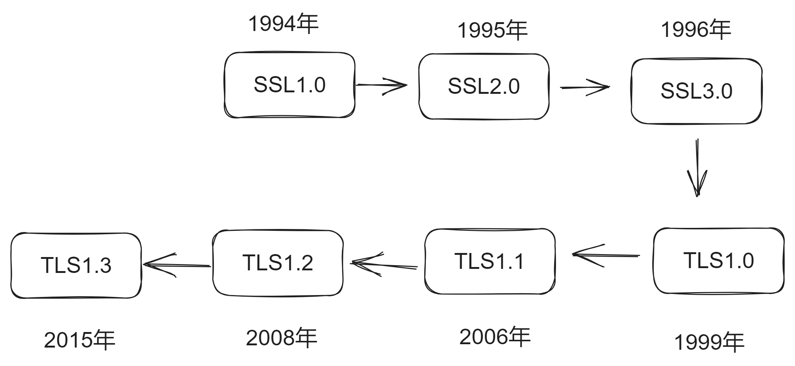
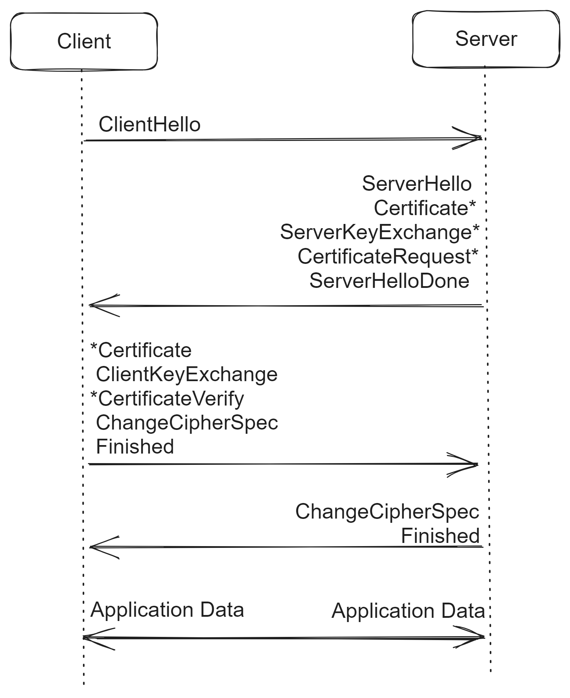

+++

author = "旅店老板"
title = "TLS1.2协议原理"
date = "2024-08-15"
description = "详细介绍TLS1.2协议的相关内容"
tags = [
	"tls",
]
categories = [
    "tls",
]
series = [""]
aliases = ["migrate-from-tls"]
image = "tls.jpg"
mermaid = true
+++
# 开始之前
如果你能对对称加密、非对称加密和TLS的背景有一定了解就更好了,不了解也没有关系。

# 简介

如上则是SSL协议到TLS协议的发展历史,本文详细对其中TLS1.2的原理进行分析。  

TLS1.2全称`The Transport Layer Security Protocol Version 1.2`。传输层安全协议版本1.2,因此TLS1.2也是基于TCP/IP的应用层协议。

该协议允许客户机/服务器应用程序以防止窃听、篡改或消息伪造的方式进行通信。  

下文中TLS1.2简称TLS。

[RFC5246](https://datatracker.ietf.org/doc/html/rfc5246)中定义了TLS1.2协议标准的详细规范。
***
# 协议内容
TLS1.2协议由两层组成:**TLS记录协议**和**使用TLS记录协议的协议**。记录协议定义了通信的数据结构(记录类型和长度等)，使用TLS记录协议的协议有四个:
* 握手协议
* 警报协议
* 更改密码规范协议
* 应用程序数据协议
## 记录协议
`TLSPlaintext`是TLS协议的基本数据结构
```c
struct {
          ContentType type;
          ProtocolVersion version;
          uint16 length;
          opaque fragment[TLSPlaintext.length];
      } TLSPlaintext;
```
* **ContentType**表示该记录的类型,占一个字节。取值有:
    * `0x14`(20):ChangeCipherSpec(更改密码规范)
    * `0x15`(21):Alert(警报)
    * `0x16`(22):Handshake（握手消息）
    * `0x17`(23):ApplicationData（应用数据）
* **ProtocolVersion**占两个字节，取值有:
    * `0x0301`:TLS1.0
    * `0x0302`:TLS1.1
    * `0x0303`:TLS1.2
* **length**表示消息记录的长度，占两个字节
* **fragment[TLSPlaintext.length]**为对应的消息记录,
***
## 握手协议
学习握手协议,我们可以始终认为有一个`中间人`想窃取我们的私密信息,比如网络服务商。这样有助于我们理解TLS协议是如何在这种情况下建立一个安全连接的。  


如上图是完整的TLS握手的消息流,多个消息并不总是一次性发送(为了提高效率通常会进行合并发送)。  

但严格按照上述的顺序发送,以意外的顺序发送握手消息会产生fatal警报并断开TCP连接。  

图中的`*`表示非必须消息。

握手协议数据就是`TLSPlaintext.type=0x16`的fragment数据，结构名称为`Handshake`。消息结构如下:
```c
struct {
          HandshakeType msg_type;    /* handshake type */
          uint24 length;             /* bytes in message */
          select (HandshakeType) {
              case hello_request:       HelloRequest;
              case client_hello:        ClientHello;
              case server_hello:        ServerHello;
              case certificate:         Certificate;
              case server_key_exchange: ServerKeyExchange;
              case certificate_request: CertificateRequest;
              case server_hello_done:   ServerHelloDone;
              case certificate_verify:  CertificateVerify;
              case client_key_exchange: ClientKeyExchange;
              case finished:            Finished;
          } body;
      } Handshake;
```
这是一个类C语言的写法,`Handshake`由三部分数据构成：
* **msg_type**：握手协议类型msg_type是一个枚举字段,取值有:
  * `hello_request(0)`
  * `client_hello(1)`
  * `server_hello(2)`
  * `certificate(11)`
  * `server_key_exchange (12)`
  * `certificate_request(13)`
  * `server_hello_done(14)`
  * `certificate_verify(15)`
  * `client_key_exchange(16)`
  * `finished(20)`
* **length**: body的长度,24位无符号整数
* **body**: 实际的握手数据, 根据`select (HandshakeType)`确定对body解析成对应的消息

### HelloRequest
`HelloRequest`就是`msg_type=0`的body,数据结构如下:
```c
struct { } HelloRequest;
```
这是一个空结构,不包含任何数据。关于此消息,有一些规范内容:  

* 服务器可以随时发送`HelloRequest`消息,作为响应客户端可以方便时发送ClientHello消息。此消息的目的不是确定哪一方是客户端或服务器，而只是启动新的协商。
* 服务器不应在客户端初始连接时立即发送HelloRequest,因为客户端当时的工作是发送ClientHello。
* 如果客户端当前正在协商会话，则客户端将忽略此消息。
* 如果客户端不希望重新协商会话，则**可能**会忽略此消息，或者如果客户端愿意，**可能**会以`no_renegotiation`警报进行响应。
* 如果服务器发送HelloRequest但未收到ClientHello响应，则**可能**会通过fatal警报关闭连接。
> **可能**表示这不是强制性要求
***

### ClientHello
`ClientHello`就是`msg_type=1`的body,数据结构如下:
```c
struct {
    ProtocolVersion client_version;
    Random random;
    SessionID session_id;
    CipherSuite cipher_suites<2..2^16-2>;
    CompressionMethod compression_methods<1..2^8-1>;
    select (extensions_present) {
        case false:
            struct {};
        case true:
            Extension extensions<0..2^16-1>;
    };
} ClientHello;
```
* **client_version**:它的类型是ProtocolVersion,客户端发送的client_version通常表示客户端希望使用的最高TLS 版本。即使客户端支持更高的版本，它也可能在握手时降级到服务器支持的较低版本。  
  TLSPlaintext中也有一个版本号,代表记录层数据的格式版本，通常用于描述这个层所传输的消息的格式和处理规则。
>记录层的版本号反映的是当前记录的格式，通常与 ClientHello 中的 client_version 无直接关系


* **random**:它的类型是Random
     ```c
              struct {
                  uint32 gmt_unix_time;
                  opaque random_bytes[28];
              } Random;
     ```
  * ggmt_unix_time标准unix32位格式的当前时间和日期自1970年1月1日午夜开始的秒，UTC，忽略闰秒）
  * random_bytes由安全随机数生成器生成的28个字节。  


* **session_id**:它的类型是SessionID,可变长度的会话标识符，如果不为空，则该值标识同一客户端和服务器之间的会话，客户端希望重用其安全参数。会话标识符可以来自较早的连接。
SessionID的实际内容由服务器定义。由于SessionID是在没有加密或立即MAC保护的情况下传输的，因此服务器不得在会话标识符中放置机密信息，也不得让虚假会话标识符的内容造成任何安全漏洞。


* **cipher_suites**:密码套件列表,包含客户机支持的密码算法组合，按照客户端的首选项（首选项优先）排列。每个密码套件定义一个密钥交换算法、一个批量加密算法（包括密钥长度）、一个MAC算法和一个PRF。  
握手期间服务端会按客户端提供的优先级选择一个支持的密码套件,如客户端的密码套件列表都不支持则返回一个fatal警报并断开连接。  

* **compression_methods**：是否启用压缩算法, 若服务端支持启用后会产生安全漏洞,此压缩特性已在TLS1.3删除,该漏洞产生原理可查看[https://en.wikipedia.org/wiki/CRIME](https://en.wikipedia.org/wiki/CRIME)


* **extensions**：扩展。这里不进行说明
***
### ServerHello


