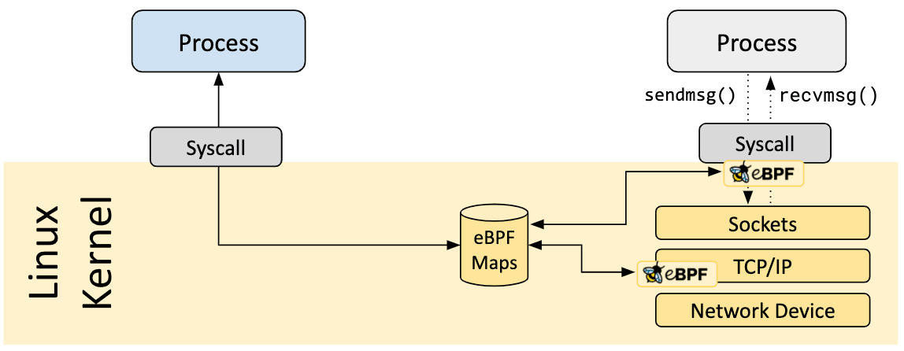

+++

author = "旅店老板"
title = "eBPF Maps"
date = "2024-05-04"
description = "介绍eBPF map的种类，用一个示例展示ebpf程序如何通过eBPF map进行内核态和用户态通信"
tags = [
	"ebpf",
]
categories = [
    "ebpf",
]
series = [""]
aliases = ["migrate-from-jekyl"]
image = "ebpf.jpg"
mermaid = true
+++
## eBPF Maps是什么
eBPF程序由用户态程序和内核态程序构成。最重要的就是能够通过map进行通信,在运行期间动态修改内核中eBPF程序的逻辑。通信的基础是用户态程序和内核态程序对eBPF Map的
修改对另一方都是可见的。如下所示:  

