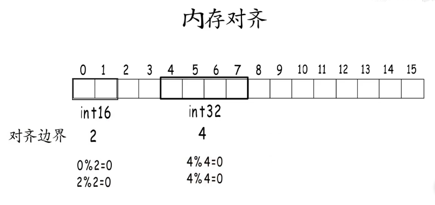

+++
author = "旅店老板"
title = "Golang中slice的基本原理"
date = "2024-05-02"
description = "golang中slice的基本原理,源码来源于go1.22.2"
tags = [
	"golang","slice",
]
categories = [
    "golang","slice",
]
series = [""]
aliases = ["golang-slice"]
image = "golang.png"
mermaid = true
+++
##创建slice

```go
	list1 := make([]int, 0)
	
	var list2 []int
	
	list3 := make([]int, 0,10)
	
	list4 := []int{1,4}
```
上面是四种创建切片的途径。创建切片,实现上是创建了一个`slice`结构体,如下：
```go
type slice struct {
	array unsafe.Pointer
	len   int
	cap   int
}
```
该结构体位于`runtime/slice.go`中，`array`是指向数组的指针, `len`表示切片的长度, `cap`表示切片的容量。 对应的创建函数`makeslice`也在该文件中

##截取slice
```go
	arr := []int{1,2,3,4,5}
	fmt.Println(arr[1:4])//[2,3,4]
```
切片的截取是**左闭右开**,截取本质是一次引用传递,无论如何截取都是复用同一片内存中的数据。截取操作会创建一个新的`SliceHeader`,`SliceHeader`是slice运行时的具体表现,该结构体位于`reflect/value.go`中
```go
type SliceHeader struct {
	Data uintptr
	Len  int
	Cap  int
}
```
## 向slice添加元素
```go
	arr := []int{1,2,3,4,5}
	arr = append(arr, 9)
	//[1,2,3,4,5,9]
```
上述代码使用`append`向切片中添加元素,添加成功后len+1,如果值大于cap会促发扩容和数据拷贝。

## 扩容slice
```go
func growslice(oldPtr unsafe.Pointer, newLen, oldCap, num int, et *_type) slice {
	oldLen := newLen - num

	if et.Size_ == 0 {
		// append should not create a slice with nil pointer but non-zero len.
		// We assume that append doesn't need to preserve oldPtr in this case.
		return slice{unsafe.Pointer(&zerobase), newLen, newLen}
	}

	newcap := nextslicecap(newLen, oldCap)

	var overflow bool
	var lenmem, newlenmem, capmem uintptr
	noscan := et.PtrBytes == 0
	switch {
	case et.Size_ == 1:
		lenmem = uintptr(oldLen)
		newlenmem = uintptr(newLen)
		capmem = roundupsize(uintptr(newcap), noscan)
		overflow = uintptr(newcap) > maxAlloc
		newcap = int(capmem)
	case et.Size_ == goarch.PtrSize:
		lenmem = uintptr(oldLen) * goarch.PtrSize
		newlenmem = uintptr(newLen) * goarch.PtrSize
		capmem = roundupsize(uintptr(newcap)*goarch.PtrSize, noscan)
		overflow = uintptr(newcap) > maxAlloc/goarch.PtrSize
		newcap = int(capmem / goarch.PtrSize)
	case isPowerOfTwo(et.Size_):
		var shift uintptr
		if goarch.PtrSize == 8 {
			// Mask shift for better code generation.
			shift = uintptr(sys.TrailingZeros64(uint64(et.Size_))) & 63
		} else {
			shift = uintptr(sys.TrailingZeros32(uint32(et.Size_))) & 31
		}
		lenmem = uintptr(oldLen) << shift
		newlenmem = uintptr(newLen) << shift
		capmem = roundupsize(uintptr(newcap)<<shift, noscan)
		overflow = uintptr(newcap) > (maxAlloc >> shift)
		newcap = int(capmem >> shift)
		capmem = uintptr(newcap) << shift
	default:
		lenmem = uintptr(oldLen) * et.Size_
		newlenmem = uintptr(newLen) * et.Size_
		capmem, overflow = math.MulUintptr(et.Size_, uintptr(newcap))
		capmem = roundupsize(capmem, noscan)
		newcap = int(capmem / et.Size_)
		capmem = uintptr(newcap) * et.Size_
	}
	
	if overflow || capmem > maxAlloc {
		panic(errorString("growslice: len out of range"))
	}

	var p unsafe.Pointer
	if et.PtrBytes == 0 {
		p = mallocgc(capmem, nil, false)
		memclrNoHeapPointers(add(p, newlenmem), capmem-newlenmem)
	} else {
		p = mallocgc(capmem, et, true)
		if lenmem > 0 && writeBarrier.enabled {
			bulkBarrierPreWriteSrcOnly(uintptr(p), uintptr(oldPtr), lenmem-et.Size_+et.PtrBytes, et)
		}
	}
	memmove(p, oldPtr, lenmem)

	return slice{p, newLen, newcap}
}
```
触发扩容调用的函数为`runtime/slice.go`的`growslice`,为方便阅读删除掉了一些判断逻辑。函数说明如下:
* `oldPtr`指向原切片数组的指针
* `newLen`新切片的长度
* `oldCap`原切片的容量
* `num`为添加的元素个数,append一次可以添加一个或多个元素。因此原切片的长度`oldLen=newLen-num`
* `et`切片中元素的实际类型
***
* `growslice`函数的前几行有`raceenabled`该变量控制是否开启竞态检测,默认是关闭的`go run`或`go build`指定`-race`开启,当变量有并发访问时控制台会打印告警信息,可以帮助我们调试代码。  


* `et.Size_ == 0`表示表示切片元素类型为这种`var list []struct{}`,`growslice`函数直接返回一个固定的`zerobase`地址。  
>在Go语言中，所有针对size==0的内存分配，用的都是同一个地址 &zerobase，所以所有空结构体地址都相同。它是**uintptr**类型  本身占8字节
* `newcap := nextslicecap(newLen, oldCap)`这行代码通过`newLen`和`oldCap`计算出新切片的容量。函数源码如下:
```go
func nextslicecap(newLen, oldCap int) int {
	newcap := oldCap
	doublecap := newcap + newcap
	if newLen > doublecap {
		return newLen
	}

	const threshold = 256
	if oldCap < threshold {
		return doublecap
	}
	for {
		newcap += (newcap + 3*threshold) >> 2
		
		if uint(newcap) >= uint(newLen) {
			break
		}
	}
	
	if newcap <= 0 {
		return newLen
	}
	return newcap
}
```
`nextslicecap`函数扩容逻辑分析如下：
* ① `newLen > doublecap`新长度大于2倍旧容量时直接返回newLen作为新容量。
  * 例如:长度和容量为0的切片，一次添加一个元素,此时切片的长度和容量为1
  * 例如:长度为2容量为10的切片，一次添加100个元素，此时切片的长度和容量为102
* ②排除上述情况后,如果旧容量小于256,则进行双倍扩容。
>go1.18之前的临界值为1024,后面变为了256
* ③旧容量大于256后执行一个for循环逻辑,`newcap += (newcap + 3*threshold) >> 2`,这个公式提供一个小切片2倍扩容到大切片1.25倍扩容的平稳过渡。
  * newcap = newcap + (newcap + 3×256) / 4 = 1.25×newcap + 192 即大于256后扩容为1.25倍再加上192 (值越大就越接近扩容1.25倍)

* ④循环退出的条件是`uint(newcap) >= uint(newLen)`
  * 例如:长度和容量为500的切片，一次性添加400个元素,500×1.25 + 192 = 817 容量不够就再增大一次`newcap`
***
回到`growslice`函数,我们发现还有一些情况会设置`newcap`,是因为go的内存分配需要根据实际的内存分配计算出真正的`newcap`
```go
func main() {
	arr := []int{1}
	fmt.Println(cap(arr))//1

	arr = append(arr, 2, 3)
	fmt.Println(cap(arr))//3

	arr = append(arr, 4, 5, 6, 7)
	fmt.Println(cap(arr))//8
}
```
分析一下上面的测试代码:
* ①第一次打印容量为1
* ②第二次添加两个元素,触发源码`newLen > doublecap`,因此`nextslicecap`函数的返回值为3,控制台也打印出了3
* ③第三次添加4个元素,触发源码`newLen > doublecap`,因此`nextslicecap`函数的返回值为7,但控制台打印出了8  


* 原因在于switch下面执行的`capmem = roundupsize(uintptr(newcap)*goarch.PtrSize, noscan)`  
`PrtSize`的值源码有解释// It is also the size of the machine's native word size (that is, 4 on 32-bit systems, 8 on 64-bit).  
64位机器下会执行下面的逻辑:
```shell
(size+smallSizeDiv-1)/smallSizeDiv = (56 + 8 - 1) / 8 = 7
size_to_class8[7] = 5
class_to_size[5] = 64 所以 roundopsize 的返回值为 64 
newcap = int(capmem / ptrSize) = int(64 / 8) = 8 ，所以最终原切片的容量扩充到了 8
```
32位机器执行的逻辑为:
```shell
(size+smallSizeDiv-1)/smallSizeDiv = (56 + 8 - 1) / 8 = 7
size_to_class8[7] = 5
class_to_size[5] = 64 所以 roundopsize 的返回值为 64 
newcap = int(capmem / ptrSize) = int(64 / 8) = 8 ，所以最终原切片的容量扩充到了 8
```
## 扩展
上一节末尾我们遇到了实际分配容量比预期要大的情况,这是对不同位数的操作系统内存对齐的原因。
>在 Golang 中，切片的内存分配涉及到内存对齐的问题。内存对齐是指在分配内存时，数据的起始地址必须是某个值的倍数。这个倍数通常是与数据类型的大小有关的，以提高访问内存的效率。
>
>原因解析：  
>内存对齐要求：  
>计算机处理内存时，通常要求数据类型的地址是其大小的倍数，例如一个 int32 变量在内存中起始地址通常应该是4的倍数，int64 变量应该是8的倍数，以此类推。
>当一个切片需要扩容时，系统会分配新的内存空间。为了满足内存对齐的要求，系统可能会分配比实际需要的更多的内存，以便确保新分配的内存块是对齐的。  
> 
>内存分配算法：  
>Golang 的运行时系统会使用一种叫做 roundupsize 的函数来确保分配的内存大小符合系统对内存对齐的要求。这个函数会将请求的内存大小向上取整到满足对齐要求的下一个合适大小。
>例如，如果一个切片需要的容量是13个字节，但是由于内存对齐的要求，实际分配的内存可能会是16个字节（如果以4字节对齐为例）。  
> 
>性能和访问效率：  
>内存对齐可以提高系统访问内存的效率，特别是在处理大量数据时，能够减少因为未对齐访问而带来的性能损失。
>虽然这会导致实际分配的内存略多于请求的内存大小，但是这种额外的空间消耗通常是为了提高整体程序的运行效率和稳定性。  
> 
>因此，切片在进行扩容时，为了满足内存对齐的要求，其实际分配的内存容量可能会比原本请求的容量略大。这是为了保证系统在处理切片时能够获得最佳的性能表现。


* 上述的int32要错开两个字节，从4开始存，却不能紧接着从2开始。  
* CPU在读取内存时是一块一块进行读取的,每块的大小与操作系统的位数有关。  
* 如果紧邻2开始存储(未对齐),CPU需要进行两次读取。  
* 常见的32位平台，指针宽度和寄存器宽度都是4字节，64位平台上都是8字节
