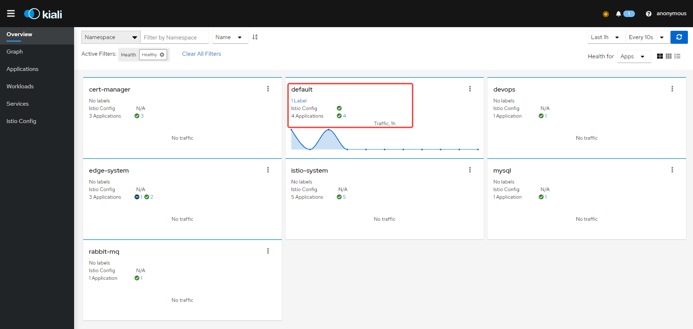
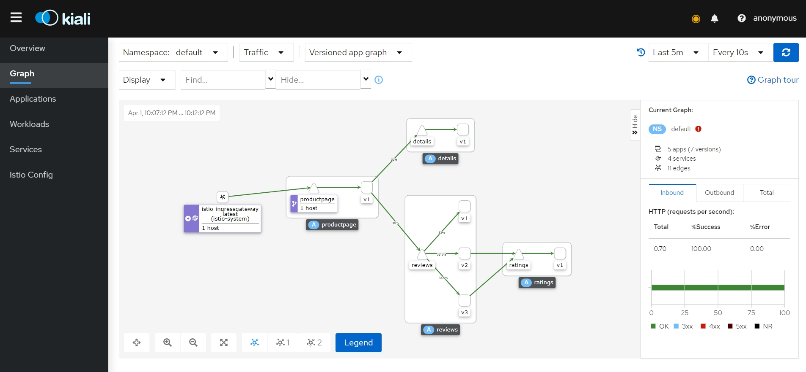
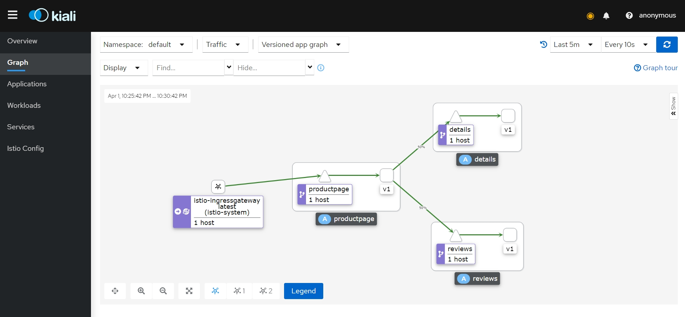
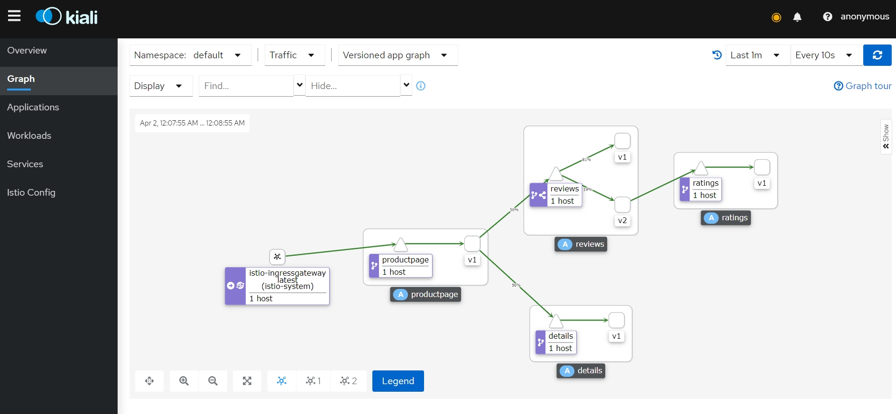

+++

author = "旅店老板"
title = "服务网格Istio"
date = "2023-04-01"
description = "Istio"
tags = [
	"istio",
]
categories = [
    "istio",
]
series = [""]
aliases = ["migrate-from-jekyl"]
image = "istio.png"
mermaid = true
+++
## 背景
### 微服务概念
微服务是用于构建应用程序的架构风格,将应用拆分成多个核心模块，每个模块称为一个服务，它们可以独立构建和部署，各个服务之前工作和出现故障的时候互不影响，它们之间是松耦合的。
### 微服务优点
* 灵活性高：服务之前松耦合，更易于理解，开发维护更快
* 支持多种编程语言：服务可以使用不同的编程语言
* 独立部署：每个微服务都是一个应用，可独立部署
* 容错性高：单体应用容易发生故障扩散，导致整个应用不可用，比如内存泄漏等，微服务架构下，故障会隔离在单个服务中
### 微服务发展进程
* 第一代微服务框架-SpringCloud。Spring社区支持，主要针对java并为开发者提供快速构建分布式系统能力的开发框架。SpringCloud是一系列微服务框架的集合，是微服务架构下的一站式解决方案
* 第二代微服务框架-Dubbo。Dubbo是一个阿里巴巴开源出来的一个分布式服务框架，支持多语言，不同语言有不同的sdk支持。Dubbo致力于提供高性能和高透明化的RPC框架
* 第三代微服务框架-Service Mesh。服务网格(Service Mesh)一个基础设施层，用来处理服务之间的通信
>服务网格由数据平面和控制平面构成。
> 
> 数据平面：服务网格把传统微服务框架的大部分能力从应用中剥离出来，拆分为独立进程，使其与业务系统解耦，以sidecar的模式进行部署。 数据平面是直接处理入站和出站的数据包，
> 进行转发、路由、健康检查、鉴权、负载均衡等  
> 
> 控制平面：与数据平面进行通信，下发策略和配置
## Istio概念
Istio是Service Mesh的具体实现，是一个适合于云原生场景下用于服务治理的平台  

| 版本       | 目前支持     | 发行日期            | 停止维护               | 支持的 Kubernetes 版本       | 未测试，可能支持的 Kubernetes 版本 |
| ---------- | ------------ | ------------------- | ---------------------- | ---------------------------- | ---------------------------------- |
| master     | 否，仅限开发 | -                   | -                      | -                            | -                                  |
| 1.16       | 是           | 2022 年 11 月 15 日 | ~ 2023 年 6 月（预期） | 1.22, 1.23, 1.24, 1.25       | 1.16, 1.17, 1.18, 1.19, 1.20, 1.21 |
| 1.15       | 是           | 2022 年 8 月 31 日  | ~ 2023 年 3 月（预期） | 1.22, 1.23, 1.24, 1.25       | 1.16, 1.17, 1.18, 1.19, 1.20, 1.21 |
| 1.14       | 否           | 2022 年 5 月 24 日  | 2022 年 12 月 27 日    | 1.21, 1.22, 1.23, 1.24       | 1.16, 1.17, 1.18, 1.19, 1.20       |
| 1.13       | 否           | 2022 年 2 月 11 日  | 2022 年 10 月 12 日    | 1.20, 1.21, 1.22, 1.23       | 1.16, 1.17, 1.18, 1.19             |
| 1.12       | 是           | 2021 年 11 月 18 日 | 2022 年 7 月 12 日     | 1.19, 1.20, 1.21, 1.22       | 1.16, 1.17, 1.18                   |
| 1.11       | 否           | 2021 年 8 月 12 日  | 2022 年 3 月 25 日     | 1.18, 1.19, 1.20, 1.21, 1.22 | 1.16, 1.17                         |
| 1.10       | 否           | 2021 年 5 月 18 日  | 2022 年 1 月 7 日      | 1.18, 1.19, 1.20, 1.21       | 1.16, 1.17, 1.22                   |
| 1.9        | 否           | 2021 年 2 月 9 日   | 2021 年 10 月 8 日     | 1.17, 1.18, 1.19, 1.20       | 1.15, 1.16                         |
| 1.8        | 否           | 2020 年 11 月 10 日 | 2021 年 5 月 12 日     | 1.16, 1.17, 1.18, 1.19       | 1.15                               |
| 1.7        | 否           | 2020 年 8 月 21 日  | 2021 年 2 月 25 日     | 1.16, 1.17, 1.18             | 1.15                               |
| 1.6 及更早 | 否           | -                   | -                      | -                            | -                                  |

## 安装
* 当前k8s版本1.18.2
```shell
[root@master ~]# kubectl version
Client Version: version.Info{Major:"1", Minor:"18", GitVersion:"v1.18.2", GitCommit:"31a3f7703ac622535d4d453fe366f9746b450463", GitTreeState:"clean", BuildDate:"2020-10-13T12:50:07Z", GoVersion:"go1.14.4", Compiler:"gc", Platform:"linux/amd64"}
Server Version: version.Info{Major:"1", Minor:"18", GitVersion:"v1.18.2", GitCommit:"52c56ce7a8272c798dbc29846288d7cd9fbae032", GitTreeState:"clean", BuildDate:"2020-04-16T11:48:36Z", GoVersion:"go1.13.9", Compiler:"gc", Platform:"linux/amd64"}
```
* 下载istio压缩包
```shell
wget https://www.github.com/istio/istio/releases/download/1.11.7/istio-1.11.7-linux-amd64.tar.gz
```
* 解压缩
```shell
tar -zxvf istio-1.11.7-linux-amd64.tar.gz
```
* 复制命令(复制后在任意目录可使用该命令)
```
cp istio-1.11.7/bin/istioctl /usr/local/bin/istioctl
```
* 查看版本
```shell
[root@master ~]# istioctl version
no running Istio pods in "istio-system"
1.11.7
```
* 通过`istioctl profile list`查看自带的配置选项

  |                        | default | demo | minimal | remote | empty | preview |
  | ---------------------- | ------- | ---- | ------- | ------ | ----- | ------- |
  | 核心组件               |         |      |         |        |       |         |
  | `istio-egressgateway`  |         | ✔    |         |        |       |         |
  | `istio-ingressgateway` | ✔       | ✔    |         |        |       | ✔       |
  | `istiod`               | ✔       | ✔    | ✔       |        |       | ✔       |

* 部署控制平面，安装demo选项
```shell
[root@master ~]# istioctl manifest apply --set profile=demo
This will install the Istio 1.11.7 demo profile with ["Istio core" "Istiod" "Ingress gateways" "Egress gateways"] components into the cluster. Proceed? (y/N) y
✔ Istio core installed                                                                                                                                                                                               
✔ Istiod installed                                                                                                                                                                                                   
✔ Ingress gateways installed                                                                                                                                                                                         
✔ Egress gateways installed                                                                                                                                                                                          
✔ Installation complete                                                                                                                                                                                              
Thank you for installing Istio 1.11.  Please take a few minutes to tell us about your install/upgrade experience!  https://forms.gle/kWULBRjUv7hHci7T6
```
* 如何卸载？
```shell
istioctl manifest generate --set profile=demo | kubectl delete --ignore-not-found=true -f -
```
* 再次查看版本,`istioctl analyze`分析命令可检查是否安装有问题
```shell
[root@master ~]# istioctl version
client version: 1.11.7
control plane version: 1.11.7
data plane version: 1.11.7 (2 proxies)
```
* 部署prometheus和kiali用于数据采集和观测(**kiali的服务修改为NodePort便于访问,本文章的kiali的服务类型为NodePort，端口为30001**)
```shell
kubectl apply -f istio-1.11.7/samples/addons/prometheus.yaml
```
```shell
kubectl apply -f istio-1.11.7/samples/addons/kiali.yaml
```
* default命名空间打标签，istio可以自动注入SideCar
```shell
kubectl label namespace default istio-injection=enabled
```
* 部署Bookinfo应用
```shell
kubectl apply -f istio-1.11.7/samples/bookinfo/platform/kube/bookinfo.yaml
```
结果如下，每个pod都有两个容器，自动注入sidecar，所有流量都会经过这个代理，具体原理后面分析
```shell
[root@master ~]# kubectl get pod
NAME                              READY   STATUS    RESTARTS   AGE
details-v1-66b6955995-r594l       2/2     Running   0          109s
productpage-v1-5d9b4c9849-99c78   2/2     Running   0          108s
ratings-v1-fd78f799f-hklbz        2/2     Running   0          109s
reviews-v1-6549ddccc5-f6f9h       2/2     Running   0          108s
reviews-v2-76c4865449-hx678       2/2     Running   0          109s
reviews-v3-6b554c875-wj72p        2/2     Running   0          109s
```
* 对外开放Bookinfo
```shell
kubectl apply -f istio-1.11.7/samples/bookinfo/networking/bookinfo-gateway.yaml
```
将istio-ingressgateway Service的Type修改为NodePort,targetPort端口为8080的nodePort修改为32437  
```shell
[root@master ~]# kubectl get svc -n=istio-system
NAME                   TYPE        CLUSTER-IP       EXTERNAL-IP   PORT(S)                                                                      AGE
istio-egressgateway    ClusterIP   10.103.210.200   <none>        80/TCP,443/TCP                                                               85m
istio-ingressgateway   NodePort    10.100.54.25     <none>        15021:32433/TCP,80:32437/TCP,443:32728/TCP,31400:32643/TCP,15443:31390/TCP   85m
istiod                 ClusterIP   10.106.117.185   <none>        15010/TCP,15012/TCP,443/TCP,15014/TCP                                        85m
kiali                  NodePort    10.101.120.69    <none>        20001:30001/TCP,9090:31459/TCP                                               326d
prometheus             ClusterIP   10.103.101.141   <none>        9090/TCP                                                                     326d
```
开放端口成功后可通过浏览器访问http://192.168.0.70:32437/productpage
## 安装的程序介绍
### Bookinfo
Bookinfo是istio官方提供给我们演示istio特性的应用，该应用由四个微服务构成：
* **productpage**：该服务是用python实现，会调用**details**和**reviews** 这两个微服务
* **details**：该微服务包含书籍信息，采用Ruby实现。
* **reviews**：该微服务包含书籍相关的评论，会调用ratings微服务
>reviews微服务有3个版本：
>
> v1版本不会调用ratings服务
>
> v2版本会调用ratings服务，并使用黑色星形图标来显示评分信息。
>
> v3版本会调用ratings服务，并使用红色星形图标来显示评分信息。
* ratings：该微服务包含书籍评价组成的评级信息

架构图如下：

每个微服务都与Envoy sidecar集成,被集成的微服务的所有出入流量都被sidecar劫持  
不断访问 http://192.168.0.70:32437/productpage 会显示不同界面
### istio相关应用
* **istiod**：为服务网格的控制平面，用于与数据平面通信，下发负载均衡等策略，低版本istio的控制平面由多个组件构成，相对高的版本已合并成istiod一个组件
* **prometheus**：用于数据采集在kiali上展示
* **kiali**：提供服务拓扑图、链路追踪、指标遥测、健康检查等功能的可视化看板  

kiali看板简介使用(http://119.91.107.218:30001)：
1.Overview属于概述模块。红框部分表示default命名空间有一个Label、有Istio Config配置规则，绿勾表示配置生效(点击可跳转到具体配置)、有四个Applications没有异常

2.Graph模块可查看服务拓扑、流量分配和服务运行情况等

## 流量管理
Istio的流量路由规则可以使你控制服务之间的流量，很容易配置A/B测试、灰度发布(也叫金丝雀发布)、基于流量百分比切分的概率发布。  

Istio的流量管理模型源于和服务一起部署的SideCar。 SideCar实际是一个轻量级的代理服务器Envoy(类似Nginx),网格内服务发送和接受的所有流量都经过Envoy，通过istio配置就能进行控制，
网格内的服务是无感知的。

BookInfo中reviews服务有三个实例，这多个实例组成负载均衡池，Envoy代理默认是轮训调度模型，请求按顺序发送给池中每个成员，依次重复。(通过不断访问http://192.168.0.70:32437/productpage可以发现相应规律)
***
### Virtual Service
虚拟服务（Virtual Service）是kubernetes的CRD资源，是Istio流量路由功能的关键拼图。每个虚拟服务包含一组路由规则，Istio 按顺序评估它们，Istio将每个给定的请求匹配到虚拟服务指定的实际目标地址  

如果没有虚拟服务，Envoy会在所有的服务实例中使用轮询的负载均衡策略分发请求。可以通过虚拟服务来改善这种情况，比如新版本分配5%的流量，大部分仍使用旧版本，等稳定后将流量全部导入新版本，这可降低新版本bug引起的损失；或让指定的内部测试人员一直使用新版本，方便测试

虚拟服务示例：  
下面的虚拟服务匹配特定用户的请求，路由到服务的不同版本。
```yaml
apiVersion: networking.istio.io/v1alpha3
kind: VirtualService
metadata:
  name: reviews
spec:
  hosts:
  - reviews
  http:
  - match:
    - headers:
        end-user:
          exact: jason
    route:
    - destination:
        host: reviews
        subset: v2
  - route:
    - destination:
        host: reviews
        subset: v3
```
#### **hosts**
```yaml
hosts:
  - reviews
```
* 使用hosts字段列举虚拟服务的主机——即用户指定的目标或是路由规则设定的目标。
* 这是客户端向服务发送请求时使用的一个或多个地址。  
* 虚拟服务主机名(目的地)可以是IP地址、DNS名称，或者依赖于平台的一个简称（例如Kubernetes服务的短名称），也可以使用通配符（“*”）前缀。虚拟服务的hosts字段实际上不必是 Istio 服务注册的一部分，它只是虚拟的目标地址
#### 路由规则
```yaml
  http:
    - match:
        - headers:
            end-user:
              exact: jason
```
**http**字段包含了虚拟服务的路由规则。**match**用来描述匹配条件，**route**用来描述路由行为，你也可以为tcp设置路由规则。
* 示例的第一个路由规则有一个条件，因此以**match**字段开始，**exact**字段表示精确匹配，所以该路由规则应用于请求头包含end-user,并且值为jason的所有http请求
***
```yaml
route:
    - destination:
        host: reviews
        subset: v2
```
**route**部分有一个**destination**字段。与虚拟服务的**hosts**字段不同，**destination**的**host**必须是存在于istio服务注册中心的实际目标地址(istio在k8s中使用的服务注册中心是coreDNS，本例中host值为k8s的服务名)，否则Envoy不知道将Envoy路由到哪里
* **destination**部分还包含**subset**字段，指定了k8s服务的子集，本例中为v2，将符合路由规则的请求转入其中
### DestinationRule
目标规则(DestinationRule)是kubernetes的CRD资源，也是Istio流量路由功能的关键部分。  

* **Virtual Service**是一个虚拟的service，描述的是满足什么条件的流量被什么后端处理  
* **DestinationRule**描述的是这个请求到达某个后端后怎么去处理，所以**负载均衡**和**熔断策略**是定义在DestinationRule
```yaml
apiVersion: networking.istio.io/v1alpha3
kind: DestinationRule
metadata:
  name: my-destination-rule
spec:
  host: my-svc
  trafficPolicy:
    loadBalancer:
      simple: RANDOM
  subsets:
  - name: v1
    labels:
      version: v1
  - name: v2
    labels:
      version: v2
    trafficPolicy:
      loadBalancer:
        simple: ROUND_ROBIN
  - name: v3
    labels:
      version: v3
```
该DestinationRule为v2设置ROUND_ROBIN策略(v2策略中，轮询负载均衡器被指定在相应的子集字段上)；为v1和v3设置了RANDOM策略
* **host**:必选字段，取值是服务注册中心中注册的服务名，可以是网格内或以serviceEntry方式注册的网格外的服务
* **subsets**:定义的服务子集，经常用来定义一个服务版本(这里对host中的服务名关联的pod进一步划分，labels中匹配pod的标签)
* **trafficPolicy**:流量策略，主要包括四个配置：
1. loadBalancer: 描述服务的负载均衡算法
```yaml
trafficPolicy:
    loadBalancer:
      simple: RANDOM #随机算法
```
**simple**取值还可以为：**ROUND_ROBIN**(轮训算法，默认算法)、**LEAST_CONN**(最少连接算法，选择活动请求较少的后端)、**PASSTHROUGH**(直接转发到连接的目标地址，不做负载均衡)
2. connectionPool: 描述服务的连接池配置
3. outlierDetection: 描述服务的异常点检查  
4. tls: 描述服务的TLS连接设置
### 路由测试
>在这之前，  
> 我们已经部署了bookinfo相关应用，请求后能在kiali查看到对应效果  
>我们已经了解了Virtual Service、 Destination Rule的相关概念


复习一下这张图，图中三角形代表虚拟服务，正方形代表负载。bookinfo有四个服务：productpage、details、reviews、ratings。ratings服务有三个版本v1、v2、v3，它们之前的流量比例大致为33%(请求次数越多越接近真实值)，猜测可能是使用的轮训或随机的负载均衡策略  
***
现在需求是将流量全部路由到v1版本，使用如下命令：
```shell
kubectl apply -f istio-1.11.7/samples/bookinfo/networking/destination-rule-all.yaml
```
destination-rule-all.yaml中定义了四个DestinationRule资源，(只取reviews部分)内容如下：
```yaml
apiVersion: networking.istio.io/v1alpha3
kind: DestinationRule
metadata:
  name: reviews
spec:
  host: reviews #k8s短服务名
  subsets:
  - name: v1    #定义子集名称为v1
    labels:
      version: v1   #选择器绑定包含标签version: v1 的pod
  - name: v2
    labels:
      version: v2
  - name: v3
    labels:
      version: v3
---
```
```shell
kubectl apply -f istio-1.11.7/samples/bookinfo/networking/virtual-service-all-v1.yaml
```
virtual-service-all-v1.yaml的内容如下：
```yaml
apiVersion: networking.istio.io/v1alpha3
kind: VirtualService
metadata:
  name: productpage
spec:
  hosts:
  - productpage
  http:
  - route:
    - destination:
        host: productpage
        subset: v1
---
apiVersion: networking.istio.io/v1alpha3
kind: VirtualService
metadata:
  name: reviews
spec:
  hosts:
  - reviews
  http:
  - route:
    - destination:
        host: reviews
        subset: v1
---
apiVersion: networking.istio.io/v1alpha3
kind: VirtualService
metadata:
  name: ratings
spec:
  hosts:
  - ratings
  http:
  - route:
    - destination:
        host: ratings
        subset: v1
---
apiVersion: networking.istio.io/v1alpha3
kind: VirtualService
metadata:
  name: details
spec:
  hosts:
  - details  #k8s服务的短名称
  http:
  - route:
    - destination:
        host: details #k8s服务的短名称
        subset: v1  #子集v1版本，这个在DestinationRule中定义
---
```
该yaml资源定义了四个虚拟服务，规则是将所有流量路由到v1版本。  

创建对应资源几秒后(等待配置传播到所有pod)，请求 http://192.168.0.70:32437/productpage 100次(使用postman的collectoins的批量请求)，查看kiali如下图：

reviews的v1版本不会调用ratings的v1版本，因此图中缺少ratings服务 

从kiali观测到我们完成了将流量全部路由到v1版本，从浏览器中也能观测到没有星星评分，而v2和v3版本有对应的黑星星和红星星

***
现在需求变更，在调用reviews服务时包含请求头end-user:jason时访问v2版本，否则访问v3版本  
我们可以使用如下命令:
```shell
kubectl apply -f istio-1.11.7/samples/bookinfo/networking/virtual-service-reviews-jason-v2-v3.yaml
```
virtual-service-reviews-jason-v2-v3.yaml的内容如下：
```yaml
apiVersion: networking.istio.io/v1alpha3
kind: VirtualService
metadata:
  name: reviews
spec:
  hosts:
  - reviews
  http:
  - match:
    - headers:
        end-user:
          exact: jason
    route:
    - destination:
        host: reviews
        subset: v2
  - route:
    - destination:
        host: reviews
        subset: v3
```
  应用该命令后浏览器打开网址 http://192.168.0.70:32437/productpage 我们会访问v3版本(红色星星)，  
多次刷新页面测试无问题后点击右上角**Sign in**, 账号设置为jason，密码任意填写，登录后我们会访问v2版本(黑色星星)，多次刷新页面测试无异常
***
如果要配置百分比流量分配的虚拟服务，我们可以使用如下命令:
```shell
kubectl apply -f istio-1.11.7/samples/bookinfo/networking/virtual-service-reviews-80-20.yaml
```
`virtual-service-reviews-80-20.yaml`的内容如下:
```yaml
apiVersion: networking.istio.io/v1alpha3
kind: VirtualService
metadata:
  name: reviews
spec:
  hosts:
    - reviews
  http:
  - route:
    - destination:
        host: reviews
        subset: v1
      weight: 80
    - destination:
        host: reviews
        subset: v2
      weight: 20
```
* **weight**: 表示流量分配的比例,在一个route下多个destination的weight的综合要求是100,如果一个route仅有一个destination，那么可以不用配置weight  

上面虚拟服务的作用是将reviews服务的流量80%分配给v1版本，20%的流量分配给v2版本

应用该资源后，请求 http://192.168.0.70:32437/productpage 100次或更多，查看kiali如下:

如图所示，访问reviews的v1版本流量占81%，v2版本流量占19%(请求次数越多越趋近概率)，实现了百分比流量分配的需求。

清除四个虚拟服务：
```yaml
kubectl delete -f istio-1.11.7/samples/bookinfo/networking/virtual-service-all-v1.yaml
```
***
### 故障注入测试

### 熔断测试
