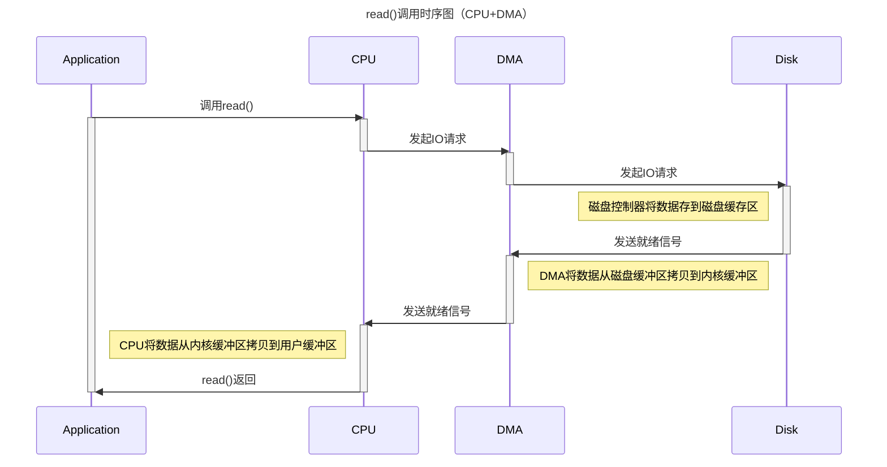

+++

author = "旅店老板"
title = "Istio原理"
date = "2023-05-02"
description = "探索Istio的原理"
tags = [
	"istio",
]
categories = [
    "istio",
]
series = [""]
aliases = ["migrate-from-jekyl"]
image = "istio.png"
mermaid = true
+++
## 开始之前
* 部署了k8s和istio的环境，本文章使用环境如下：
```shell
[root@master ~]# kubectl version
Client Version: version.Info{Major:"1", Minor:"18", GitVersion:"v1.18.2", GitCommit:"31a3f7703ac622535d4d453fe366f9746b450463", GitTreeState:"clean", BuildDate:"2020-10-13T12:50:07Z", GoVersion:"go1.14.4", Compiler:"gc", Platform:"linux/amd64"}
Server Version: version.Info{Major:"1", Minor:"18", GitVersion:"v1.18.2", GitCommit:"52c56ce7a8272c798dbc29846288d7cd9fbae032", GitTreeState:"clean", BuildDate:"2020-04-16T11:48:36Z", GoVersion:"go1.13.9", Compiler:"gc", Platform:"linux/amd64"}

[root@master ~]# istioctl version
client version: 1.11.7
control plane version: 1.11.7
data plane version: 1.11.7 (9 proxies)
```

* 了解了Istio的重要术语，了解了Istio的基本使用，如果还不熟悉，请参考
[Istio入门](https://www.baidu.com/ 'istio')、[基于Istio实现金丝雀发布](https://www.baidu.com/ 'istio')这两篇文章的内容。

## SideCar
在使用Istio部署应用时，注意到pod中被注入了一个容器，我们称之为边车(SideCar)。 SideCar会劫持进出工作负载的所有流量。在注入方式上有**手动注入**和**自动注入**
### 手动注入
创建`deploy.yaml`资源，内容如下：
```yaml
apiVersion: apps/v1
kind: Deployment
metadata:
  name: nginx
spec:
  replicas: 1
  selector:
    matchLabels:
      app: nginx
  template:
    metadata:
      labels:
        app: nginx
    spec:
      containers:
        - name: nginx
          image: nginx
          imagePullPolicy: Always
```
使用如下命令生成注入SideCar后的新资源文件:
```shell
istioctl kube-inject deploy.yaml -o deploy-new.yaml
```
`deploy-new.yaml`文件内容(省略了大部分其他配置)如下：
```yaml
apiVersion: apps/v1
kind: Deployment
metadata:
  name: nginx
spec:
  replicas: 1
  selector:
    matchLabels:
      app: nginx
  template:
    metadata:
      labels:
        app: nginx
    spec:
      containers:
      - image: nginx
        imagePullPolicy: Always
        name: nginx
        resources: {}
      - args:
        
        image: docker.io/istio/proxyv2:1.11.7
        name: istio-proxy
        ports:
        - containerPort: 15090
          name: http-envoy-prom
          protocol: TCP

      initContainers:
      - args:
        - istio-iptables
        - -p
        - "15001"
        - -z
        - "15006"
        - -u
        - "1337"
        - -m
        - REDIRECT
        - -i
        - '*'
        - -x
        - ""
        - -b
        - '*'
        - -d
        - 15090,15021,15020
        image: docker.io/istio/proxyv2:1.11.7
        name: istio-init
        securityContext:
          allowPrivilegeEscalation: false
          capabilities:
            add:
              - NET_ADMIN
              - NET_RAW
            drop:
              - ALL
---
```
新的资源中注入了两个容器：**istio-init**和**istio-proxy**。它们使用的镜像都是docker.io/istio/proxyv2:1.11.7，
* **istio-init**是属于k8s的initContainers，它的作用是设置iptables规则(capabilities字段中授予了网络相关权限)
* **istio-proxy**是基于Envoy(看做轻量级Nginx)实现的一个网络代理容器，该容器以1337用户在限制权限下运行，所有工作负载的用户id要与之不同

从初始化容器istio-init中的args整理出如下命令(该容器的启动入口)：
```shell
istio-iptables -p 15001 -z 15006 -u 1337 -m REDIRECT -i '*' -x "" -b '*' -d 15090,15021,15020
```
istio-iptables是基于iptables命令实现，要理解该命令首先要了解istio的各个端口作用  
istio sidecar代理(Envoy)使用的端口和协议如下：

| 端口  | 协议 | 描述                                                  | 仅限 Pod 内部 |
| ----- | ---- | ----------------------------------------------------- | ------------- |
| 15000 | TCP  | Envoy 管理端口（命令/诊断）                           | 是            |
| 15001 | TCP  | Envoy 出站                                            | 否            |
| 15004 | HTTP | 调试端口                                              | 是            |
| 15006 | TCP  | Envoy 入站                                            | 否            |
| 15008 | H2   | HBONE mTLS 隧道端口                                   | 否            |
| 15009 | H2C  | 用于安全网络的 HBONE 端口                             | 否            |
| 15020 | HTTP | 从 Istio 代理、Envoy 和应用程序合并的 Prometheus 遥测 | 否            |
| 15021 | HTTP | 健康检查                                              | 否            |
| 15053 | DNS  | DNS 端口，如果启用了捕获                              | 是            |
| 15090 | HTTP | Envoy Prometheus 遥测                                 | 否            |
>为避免与sidecar发生端口冲突，应用程序不应使用Envoy使用的任何端口。

istio控制平面(istiod)使用的端口和协议如下：

| 端口  | 协议  | 描述                                        | 仅限本地主机 |
| ----- | ----- | ------------------------------------------- | ------------ |
| 443   | HTTPS | Webhook 服务端口                            | 否           |
| 8080  | HTTP  | 调试接口（已弃用，仅限容器端口）            | 否           |
| 15010 | GRPC  | XDS 和 CA 服务（纯文本，仅用于安全网络）    | 否           |
| 15012 | GRPC  | XDS 和 CA 服务（TLS 和 mTLS，推荐用于生产） | 否           |
| 15014 | HTTP  | 控制平面监控                                | 否           |
| 15017 | HTTPS | Webhook 容器端口，从 443 转发               | 否           |
因此`istio-iptables -p 15001 -z 15006 -u 1337 -m REDIRECT -i '*' -x "" -b '*' -d 15090,15021,15020`命令的作用是：
* 将所有出站流量都重定向到Envoy的15001端口
* 将所有入站流量都重定向到Envoy的15006端口，15090端口和15020端口和15021端口的除外
* 上述规则对1337的用户除外(因为1337是istio-proxy自身的流量)
### 自动注入
自动注入的逻辑与手动注入一样，注入主要依赖k8s的webhook准入控制器实现  

准入控制器会拦截 Kubernetes API Server 收到的请求，拦截发生在认证和鉴权完成之后，对象进行持久化之前  

有两种类型的准入控制器：**Validating** 和 **Mutating**。Validating类型的Webhook可以自定义策略是否拒绝请求，Mutating类型的Webhook可以自定义配置编辑请求


