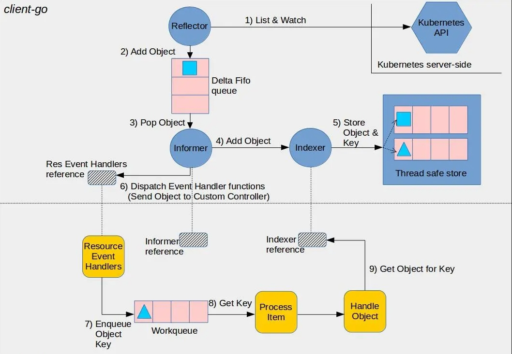

+++

author = "旅店老板"
title = "k8s源码学习之kube-controller-manager"
date = "2024-03-03"
description = "k8s源码学习之kube-controller-manager"
tags = [
	"istio",
]
categories = [
    "istio",
]
series = [""]
aliases = ["migrate-from-jekyl"]
image = "k8s.jpg"
mermaid = true
+++
## Kubernetes组件

* **kube-apiserver**：是Kubernetes控制平面的组件，负责对外开放Kubernetes API,接受处理http请求，是Kubernetes控制平面的前端。
* **etcd**:是一款分布式键值存储存储中间件，用于Kubernetes的所有集群数据的后台数据库。
* **kube-scheduler**：调度器是Kubernetes控制平面的组件，负责监听新创建、未指定运行节点的Pods，并选择最合适的节点让Pod运行。
>kube-scheduler调度策略因素包含单个Pod及Pods集合的资源需求、软硬件约束、亲和性规则等
* **kube-controller-manager**：控制器管理器是Kubernetes控制平面的组件， 负责运行控制器。
* **cloud-controller-manager**：云控制器管理器是Kubernetes控制平面的组件，负责与云平台交互。(本地环境运行k8s不需要启动该组件)
* **node**:节点组件，负责维护Pod的运行环境。
* **kubelet**：在集群的每个node上运行，从kube-apiserver组件接收新的或修改的PodSpecs，并确保Pod及其容器在期望规范下运行，同时向kube-apiserver汇报主机的运行状况。
* **kube-proxy**：是集群中每个节点上运行的网络代理，维护节点上的一些网络规则， 这些网络规则会允许从集群内部或外部的网络会话与Pod进行网络通信。
* **容器运行时(Container Runtime)**:用于支持许多容器运行环境。
## kube-controller-manager
### 启动控制器管理器
启动入口在`cmd/kube-controller-manager/controller-manager.go`的main()函数，保留主干代码如下:
```go
func main() {
	
	command := app.NewControllerManagerCommand()
	
	if err := command.Execute(); err != nil {
		os.Exit(1)
	}
}
```
核心函数就两行:
1. `command := app.NewControllerManagerCommand()`创建一个`*cobra.Command`对象
2. `command.Execute()`会调用`*cobra.Command`对象的那个Run字段
***
`NewControllerManagerCommand()`函数保留主干代码如下:
```go
func NewControllerManagerCommand() *cobra.Command {
	s, err := options.NewKubeControllerManagerOptions()
	if err != nil {
		klog.Fatalf("unable to initialize command options: %v", err)
	}

	cmd := &cobra.Command{
		Use: "kube-controller-manager",
		Long: ``,
		Run: func(cmd *cobra.Command, args []string) {
			
			c, err := s.Config(KnownControllers(), ControllersDisabledByDefault.List())
			if err := Run(c.Complete(), wait.NeverStop); err != nil {
				fmt.Fprintf(os.Stderr, "%v\n", err)
				os.Exit(1)
			}
		},
	}

	fs := cmd.Flags()
	namedFlagSets := s.Flags(KnownControllers(), ControllersDisabledByDefault.List())
	for _, f := range namedFlagSets.FlagSets {
		fs.AddFlagSet(f)
	}
	
	return cmd
}
```
核心方法大概是三行：
1. `options.NewKubeControllerManagerOptions()`创建了`*KubeControllerManagerOptions`对象，是apiserver的连接配置信息和所有k8s自有控制器(如ServiceController、DeploymentController等等)的配置
2. 循环中的`AddFlagSet()`函数是为`cobra.Command`设置flag，`rootCmd.PersistentFlags().StringVarP(&ip,"ip","i" , "localhost", "主机名")`这种方式设置flag的原理与`AddFlagSet()`函数是一致的
3. cobra最终调用的是`Run(c.Complete(), wait.NeverStop)`函数，`wait.NeverStop`是一个不接受停止信号的channel
***
`Run()`函数保留主干代码如下:
```go
func Run(c *config.CompletedConfig, stopCh <-chan struct{}) error {
	//...
	
	run := func(ctx context.Context) {
		rootClientBuilder := controller.SimpleControllerClientBuilder{
			ClientConfig: c.Kubeconfig,
		}
		var clientBuilder controller.ControllerClientBuilder
		controllerContext, err := CreateControllerContext(c, rootClientBuilder, clientBuilder, ctx.Done())
		
		
		saTokenControllerInitFunc := serviceAccountTokenControllerStarter{rootClientBuilder: rootClientBuilder}.startServiceAccountTokenController
		if err := StartControllers(controllerContext, saTokenControllerInitFunc, NewControllerInitializers(controllerContext.LoopMode), unsecuredMux); err != nil {
			klog.Fatalf("error starting controllers: %v", err)
		}

		controllerContext.InformerFactory.Start(controllerContext.Stop)
		controllerContext.ObjectOrMetadataInformerFactory.Start(controllerContext.Stop)
		close(controllerContext.InformersStarted)

		select {}
	}

	if !c.ComponentConfig.Generic.LeaderElection.LeaderElect {
		run(context.TODO())
		panic("unreachable")
	}
	
	//...
}
```
* 外部传入`NeverStop`表示这个channel不会接受停止信号，不知道为什么函数内改名为`stopCh`
* 省略Run函数的上半部分代码开启了`/metrics`(指标监控)、`/configz`(以JSON格式为所有注册的ComponentConfigs提供服务)、`/healthz`(健康检查)、`/debug/pprof`(性能分析)路径的http接口
* `CreateControllerContext`创建控制器的上下文，`StartControllers`是启动所有启动控制器
* 如果是非集群模式直接调用`run(context.TODO())`,最终调用的核心逻辑为`StartControllers`
* 省略Run函数的下半部分代码为集群配置，将OnStartedLeading设置为`run(context.TODO())`，最终也会执行这个逻辑，与kube-scheduler的集群选主实现的方式基本一致
***
### `StartControllers`
`StartControllers`保留主干代码如下：
```go
// StartControllers starts a set of controllers with a specified ControllerContext
func StartControllers(ctx ControllerContext, startSATokenController InitFunc, controllers map[string]InitFunc, unsecuredMux *mux.PathRecorderMux) error {
	
	if _, _, err := startSATokenController(ctx); err != nil {
		return err
	}
	
	for controllerName, initFn := range controllers {
		if !ctx.IsControllerEnabled(controllerName) {//上下文中对特殊控制器配置开启或者关闭
			klog.Warningf("%q is disabled", controllerName)
			continue
		}

		time.Sleep(wait.Jitter(ctx.ComponentConfig.Generic.ControllerStartInterval.Duration, ControllerStartJitter))
		
		debugHandler, started, err := initFn(ctx)
		
		if !started {
			klog.Warningf("Skipping %q", controllerName)
			continue
		}
		if debugHandler != nil && unsecuredMux != nil {
			basePath := "/debug/controllers/" + controllerName
			unsecuredMux.UnlistedHandle(basePath, http.StripPrefix(basePath, debugHandler))
			unsecuredMux.UnlistedHandlePrefix(basePath+"/", http.StripPrefix(basePath, debugHandler))
		}
		klog.Infof("Started %q", controllerName)
	}

	return nil
}
```
* `startSATokenController(ctx)`:首先启动SA token controller，因为它需要为其他控制器颁发token，如果执行失败，直接返回error，因为其他控制器无法获取凭据
* 遍历controllers 执行`initFn(ctx)`启动控制器，controllers是一个`map[string]InitFunc`结构，在`NewControllerInitializers`中初始化，保留部分代码如下：  
1. 调用位置在:**StartControllers**(controllerContext, saTokenControllerInitFunc, **NewControllerInitializers(controllerContext.LoopMode**), unsecuredMux)
```go
func NewControllerInitializers(loopMode ControllerLoopMode) map[string]InitFunc {
	controllers := map[string]InitFunc{}
	controllers["endpoint"] = startEndpointController
	controllers["endpointslice"] = startEndpointSliceController
	controllers["replicationcontroller"] = startReplicationController
	controllers["podgc"] = startPodGCController
	controllers["resourcequota"] = startResourceQuotaController
	controllers["namespace"] = startNamespaceController
	controllers["serviceaccount"] = startServiceAccountController
	controllers["garbagecollector"] = startGarbageCollectorController
	controllers["daemonset"] = startDaemonSetController
	controllers["job"] = startJobController
	controllers["deployment"] = startDeploymentController
	controllers["replicaset"] = startReplicaSetController
	controllers["horizontalpodautoscaling"] = startHPAController
	controllers["disruption"] = startDisruptionController
	controllers["statefulset"] = startStatefulSetController
	controllers["cronjob"] = startCronJobController
	controllers["csrsigning"] = startCSRSigningController
	controllers["csrapproving"] = startCSRApprovingController
	controllers["csrcleaner"] = startCSRCleanerController
	controllers["ttl"] = startTTLController
	controllers["bootstrapsigner"] = startBootstrapSignerController
	controllers["tokencleaner"] = startTokenCleanerController
	controllers["nodeipam"] = startNodeIpamController
	controllers["nodelifecycle"] = startNodeLifecycleController
	if loopMode == IncludeCloudLoops {
		controllers["service"] = startServiceController
		controllers["route"] = startRouteController
		controllers["cloud-node-lifecycle"] = startCloudNodeLifecycleController
		// TODO: volume controller into the IncludeCloudLoops only set.
	}
	controllers["persistentvolume-binder"] = startPersistentVolumeBinderController
	controllers["attachdetach"] = startAttachDetachController
	controllers["persistentvolume-expander"] = startVolumeExpandController
	controllers["clusterrole-aggregation"] = startClusterRoleAggregrationController
	controllers["pvc-protection"] = startPVCProtectionController
	controllers["pv-protection"] = startPVProtectionController
	controllers["ttl-after-finished"] = startTTLAfterFinishedController
	controllers["root-ca-cert-publisher"] = startRootCACertPublisher

	return controllers
}
```
2. 共有33个基础控制器，如果依赖云环境配置，还会额外启动三个控制器(service、route、cloud-node-lifecycle)
* 控制器启动函数`debugHandler, started, err := initFn(ctx)`会返回`debugHandler`、`started`
1. started为false，日志打印跳过该控制器，具体原因后面分析
2. debugHandler不为空时，会创建一个对应的http handler，基础路径为`"/debug/controllers/" + controllerName`
***
### 常见控制器启动逻辑
上一节我们已经分析到遍历controllers执行`initFn(ctx)`启动我们配置的自有控制器，下面以两个常见的控制器进行分析：
* `controllers["endpoint"] = startEndpointController`,`startEndpointController`的具体逻辑如下：
```go
func startEndpointController(ctx ControllerContext) (http.Handler, bool, error) {
	go endpointcontroller.NewEndpointController(
		ctx.InformerFactory.Core().V1().Pods(),
		ctx.InformerFactory.Core().V1().Services(),
		ctx.InformerFactory.Core().V1().Endpoints(),
		ctx.ClientBuilder.ClientOrDie("endpoint-controller"),
		ctx.ComponentConfig.EndpointController.EndpointUpdatesBatchPeriod.Duration,
	).Run(int(ctx.ComponentConfig.EndpointController.ConcurrentEndpointSyncs), ctx.Stop)
	return nil, true, nil
}
```
* 从`NewEndpointController()`的入参可以看出endpoint控制器监听**Pod、Service、Endpoint**资源的变化
* 创建控制器后执行了自身的`Run()`函数，接受两个参数：
1. int类型的ConcurrentEndpointSyncs表示并行endpoint操作的数量，数量越大，endpoint更新的频率越快，但需要更多的CPU和网络负载
2. ctx.Stop表示一个接受停止信号的channel
* `Run(int(ctx.ComponentConfig.EndpointController.ConcurrentEndpointSyncs), ctx.Stop)`函数的代码如下：
```go
func (e *EndpointController) Run(workers int, stopCh <-chan struct{}) {
	defer utilruntime.HandleCrash()
	defer e.queue.ShutDown()

	klog.Infof("Starting endpoint controller")
	defer klog.Infof("Shutting down endpoint controller")

	if !cache.WaitForNamedCacheSync("endpoint", stopCh, e.podsSynced, e.servicesSynced, e.endpointsSynced) {
		return
	}

	for i := 0; i < workers; i++ {
		go wait.Until(e.worker, e.workerLoopPeriod, stopCh)
	}

	go func() {
		defer utilruntime.HandleCrash()
		e.checkLeftoverEndpoints()
	}()

	<-stopCh
}
```
* 根据workers并行数量开启多个携程执行`wait.Until(e.worker, e.workerLoopPeriod, stopCh)`
1. `e.workerLoopPeriod`定时任务的时间间隔
2. `stopCh`接受停止信号的channel
3. `e.worker`需要执行的任务,代码如下：
```go
func (e *EndpointController) worker() {
	for e.processNextWorkItem() {
	}
}

func (e *EndpointController) processNextWorkItem() bool {
	eKey, quit := e.queue.Get()
	if quit {
		return false
	}
	defer e.queue.Done(eKey)

	err := e.syncService(eKey.(string))
	e.handleErr(err, eKey)

	return true
}
```
* 循环调用`processNextWorkItem`,当队列返回`quit`为true时结束循环，`e.queue.Get()`从队里中获取需要处理的元素可以保证多个并行的worker不会同时处理相同的元素
* `syncService`是EndpointController的核心逻辑
### 问题解决
从上一节中学习到从启动控制器管理器程序，到启动默认配置的控制器，最后循环从控制器的队列成员`queue`中获取`key`元素进行最终处理。此时可能会有一些疑惑：
比如：  
**queue的元素是从哪儿来的？**   
**queue中获取到的key元素是什么？**  

为了更好地了解控制器的数据来源，来看一下下面这个架构图，后面将通过架构图来了解相关源码

1. `Reflector`通过`List&Watch`从apiserver获取数据
2. `Reflector`将获取的数据放入到`Delta Fifo`队列
3. `Informer`从`Delta Fifo`队列Pop数据
4. `Informer`将获取的数据发给`Indexer`
5. `Indexer`将数据存储为key-value格式
6. `Informer`将获取的数据发给控制器的handler处理
7. handler处理后将数据的key放入`Workqueue`
8. 控制器循环获取`Workqueue`的key(**比如EndpointController的processNextWorkItem函数**)
9. `Handle Object`(**比如EndpointController的syncService函数**)在Indexer中通过key获取value进行最终处理

* Reflector结构体，代码位于`k8s.io/client-go/tools/cache/reflector.go`中，保留核心代码如下所示：
```go
// Reflector监视指定的资源，并使所有更改都反映在给定的存储中
type Reflector struct {
	name string
	
	store Store
	
	listerWatcher ListerWatcher
}
```
`store`存储监视并已修改的资源，`listerWatcher`实现了资源的List&Watch接口(apiserver提供的接口)
* Reflector实现了一个`Run`函数,代码如下：
```go
func (r *Reflector) Run(stopCh <-chan struct{}) {
	klog.V(2).Infof("Starting reflector %s (%s) from %s", r.expectedTypeName, r.resyncPeriod, r.name)
	wait.BackoffUntil(func() {
		if err := r.ListAndWatch(stopCh); err != nil {
			utilruntime.HandleError(err)
		}
	}, r.backoffManager, true, stopCh)
	klog.V(2).Infof("Stopping reflector %s (%s) from %s", r.expectedTypeName, r.resyncPeriod, r.name)
}
```
调用了自身的`ListAndWatch`函数，该函数的逻辑主要就是将从apiserver获取的数据存入自身的`store`中

了解了控制器管理器中的数据流向和一些关键数据结构，接下来从源码的角度来理解这一过程：
* `CreateControllerContext`在上一节中粗略提到过该函数，该函数是为了创建控制器上下文，简化代码如下：
```go
func CreateControllerContext(s *config.CompletedConfig, rootClientBuilder, clientBuilder controller.ControllerClientBuilder, stop <-chan struct{}) (ControllerContext, error) {
	versionedClient := rootClientBuilder.ClientOrDie("shared-informers")
	sharedInformers := informers.NewSharedInformerFactory(versionedClient, ResyncPeriod(s)())
	
	ctx := ControllerContext{
		ClientBuilder:                   clientBuilder,
		InformerFactory:                 sharedInformers,
        //...
	}
	return ctx, nil
}
```
控制器上下文`ControllerContext`中初始化了一个`InformerFactory`字段值为`sharedInformers`，`sharedInformers`的实际类型为`sharedInformerFactory`，实现了`SharedInformerFactory`接口，用来管理各资源的informer实例，     
`sharedInformerFactory`结构体中有一个`informers`字段，类型为`make(map[reflect.Type]cache.SharedIndexInformer)`，用来存储各资源实例
* `informers`的赋值
```go
func startEndpointController(ctx ControllerContext) (http.Handler, bool, error) {
	go endpointcontroller.NewEndpointController(
		ctx.InformerFactory.Core().V1().Pods(),
		ctx.InformerFactory.Core().V1().Services(),
		ctx.InformerFactory.Core().V1().Endpoints(),
		ctx.ClientBuilder.ClientOrDie("endpoint-controller"),
		ctx.ComponentConfig.EndpointController.EndpointUpdatesBatchPeriod.Duration,
	).Run(int(ctx.ComponentConfig.EndpointController.ConcurrentEndpointSyncs), ctx.Stop)
	return nil, true, nil
}
```
上面这段代码比较熟悉，上一节中我们粗略地说明该段代码创建EndpointController会监听Pod、Service、Endpoint三种资源，并最终执行Run函数  
控制器上下文`ControllerContext`中`InformerFactory`在这里被用到了,形如`ctx.InformerFactory.Core().V1().Pods()`这种
```go
func (f *sharedInformerFactory) Core() core.Interface {
	return core.New(f, f.namespace, f.tweakListOptions)
}
```
```go
func (g *group) V1() v1.Interface {
	return v1.New(g.factory, g.namespace, g.tweakListOptions)
}
```
```go
func (v *version) Pods() PodInformer {
	return &podInformer{factory: v.factory, namespace: v.namespace, tweakListOptions: v.tweakListOptions}
}
```
实际我们传入的是一个跟InformerFactory创建的PodInformer,对应还有ServiceInformer、EndpointsInformer，`NewEndpointController`函数细节如下：
```go
func NewEndpointController(podInformer coreinformers.PodInformer, serviceInformer coreinformers.ServiceInformer,
	endpointsInformer coreinformers.EndpointsInformer, client clientset.Interface, endpointUpdatesBatchPeriod time.Duration) *EndpointController {

	if client != nil && client.CoreV1().RESTClient().GetRateLimiter() != nil {
		ratelimiter.RegisterMetricAndTrackRateLimiterUsage("endpoint_controller", client.CoreV1().RESTClient().GetRateLimiter())
	}
	e := &EndpointController{
		client:           client,
		queue:            workqueue.NewNamedRateLimitingQueue(workqueue.DefaultControllerRateLimiter(), "endpoint"),
		workerLoopPeriod: time.Second,
	}

	serviceInformer.Informer().AddEventHandler(cache.ResourceEventHandlerFuncs{
		AddFunc: e.onServiceUpdate,
		UpdateFunc: func(old, cur interface{}) {
			e.onServiceUpdate(cur)
		},
		DeleteFunc: e.onServiceDelete,
	})
	e.serviceLister = serviceInformer.Lister()

	podInformer.Informer().AddEventHandler(cache.ResourceEventHandlerFuncs{
		AddFunc:    e.addPod,
		UpdateFunc: e.updatePod,
		DeleteFunc: e.deletePod,
	})
	e.podLister = podInformer.Lister()

	e.endpointsLister = endpointsInformer.Lister()

	e.serviceSelectorCache = endpointutil.NewServiceSelectorCache()

	return e
```
* 该函数创建了一个`EndpointController`,EndpointController有一个字段为`queue`，每个控制器都有一个队列，这就是上面架构图中的`workQueue`
* 传入的三个informer都进行了相似的操作，以`podInformer`为例来熟悉一下代码的细节  

`podInformer.Informer()`调用详情如下：
```go
func (f *podInformer) Informer() cache.SharedIndexInformer {
	return f.factory.InformerFor(&corev1.Pod{}, f.defaultInformer)
}
```
`Informer()`中调用了`InformerFor`,详情如下：
```go
func (f *sharedInformerFactory) InformerFor(obj runtime.Object, newFunc internalinterfaces.NewInformerFunc) cache.SharedIndexInformer {
	f.lock.Lock()
	defer f.lock.Unlock()

	informerType := reflect.TypeOf(obj)
	informer, exists := f.informers[informerType]
	if exists {
		return informer
	}

	resyncPeriod, exists := f.customResync[informerType]
	if !exists {
		resyncPeriod = f.defaultResync
	}

	informer = newFunc(f.client, resyncPeriod)
	f.informers[informerType] = informer

	return informer
}
```
obj是对应资源的实例，该函数从`sharedInformerFactory`的`informers`这个map获取对应资源的informer实例，key为对应资源的type,informer实例的类型为`SharedIndexInformer`    

如果没有则创建对应资源的informer，添加到map结构中，`InformerFor`函数是加锁的，因此各个资源的informer是单例的  

创建informer是调用`newFunc`实现，`newFunc`即是外部传入的`f.defaultInformer`,最终调用了`NewFilteredServiceInformer`,详细代码如下：
```go
func NewFilteredPodInformer(client kubernetes.Interface, namespace string, resyncPeriod time.Duration, indexers cache.Indexers, tweakListOptions internalinterfaces.TweakListOptionsFunc) cache.SharedIndexInformer {
	return cache.NewSharedIndexInformer(
		&cache.ListWatch{// 实现了List和Watch函数
			ListFunc: func(options metav1.ListOptions) (runtime.Object, error) {
				if tweakListOptions != nil {
					tweakListOptions(&options)
				}
				return client.CoreV1().Pods(namespace).List(context.TODO(), options)
			},
			WatchFunc: func(options metav1.ListOptions) (watch.Interface, error) {
				if tweakListOptions != nil {
					tweakListOptions(&options)
				}
				return client.CoreV1().Pods(namespace).Watch(context.TODO(), options)
			},
		},
		&corev1.Pod{},
		resyncPeriod,
		indexers,//map[string]IndexFunc
	)
}
```
调用了`NewSharedIndexInformer`,创建对应资源的`sharedIndexInformer`，都会实现ListerWatcher接口，`NewSharedIndexInformer`的细节如下：
```go
func NewSharedIndexInformer(lw ListerWatcher, exampleObject runtime.Object, defaultEventHandlerResyncPeriod time.Duration, indexers Indexers) SharedIndexInformer {
	realClock := &clock.RealClock{}
	sharedIndexInformer := &sharedIndexInformer{
		processor:                       &sharedProcessor{clock: realClock},
		indexer:                         NewIndexer(DeletionHandlingMetaNamespaceKeyFunc, indexers),
		listerWatcher:                   lw,
		//...
	}
	return sharedIndexInformer
}
```
有三个比较重要的成员变量，`listerWatcher`实现了List和Watch接口，`indexer`通过NewIndexer创建,细节如下：
```go
// The key uses the format <namespace>/<name> unless <namespace> is empty, then
// it's just <name>.
func NewIndexer(keyFunc KeyFunc, indexers Indexers) Indexer {
	return &cache{
		cacheStorage: NewThreadSafeStore(indexers, Indices{}),
		keyFunc:      keyFunc,
	}
}
```
`keyFunc`表示生成key的逻辑，具体为有命名空间key为`meta.namespace/meta.name`,命名空间为空，key为`meta.name`  
`NewThreadSafeStore`顾名思义创建了线程安全的store，代码如下：
```go
func NewThreadSafeStore(indexers Indexers, indices Indices) ThreadSafeStore {
	return &threadSafeMap{
		items:    map[string]interface{}{},
		indexers: indexers,//外部传入的key为namespace，value为MetaNamespaceIndexFunc(obj转为meta，返回[]string{meta.GetNamespace()})
		indices:  indices,
	}
}
```
`threadSafeMap`实现了`threadSafeStore`接口

返回到`NewEndpointController`函数，`AddEventHandler`函数作用是添加各个资源事件的处理函数,，详情如下：
```go
func (s *sharedIndexInformer) AddEventHandler(handler ResourceEventHandler) {
	s.AddEventHandlerWithResyncPeriod(handler, s.defaultEventHandlerResyncPeriod)
}
```
`AddEventHandler`函数调用了`AddEventHandlerWithResyncPeriod`,保留主干代码如下：
```go
func (s *sharedIndexInformer) AddEventHandlerWithResyncPeriod(handler ResourceEventHandler, resyncPeriod time.Duration) {
	s.startedLock.Lock()
	defer s.startedLock.Unlock()

	
	listener := newProcessListener(handler, resyncPeriod, determineResyncPeriod(resyncPeriod, s.resyncCheckPeriod), s.clock.Now(), initialBufferSize)

	if !s.started {
		s.processor.addListener(listener)
		return
	}

	// in order to safely join, we have to
	// 1. stop sending add/update/delete notifications
	// 2. do a list against the store
	// 3. send synthetic "Add" events to the new handler
	// 4. unblock
	s.blockDeltas.Lock()
	defer s.blockDeltas.Unlock()

	s.processor.addListener(listener)
	for _, item := range s.indexer.List() {
		listener.add(addNotification{newObj: item})
	}
}
```
`newProcessListener`创建了`processorListener`,代码如下：
```go
func newProcessListener(handler ResourceEventHandler, requestedResyncPeriod, resyncPeriod time.Duration, now time.Time, bufferSize int) *processorListener {
	ret := &processorListener{
		nextCh:                make(chan interface{}),
		addCh:                 make(chan interface{}),
		handler:               handler,
		pendingNotifications:  *buffer.NewRingGrowing(bufferSize),
		requestedResyncPeriod: requestedResyncPeriod,
		resyncPeriod:          resyncPeriod,
	}

	ret.determineNextResync(now)

	return ret
}
```
`processorListener`有三个重要的成员变量,两个channel：`nextCh`和`addCh`,和一个`handler`,`handler`绑定有对应的`OnAdd`、`OnUpdate`、`OnDelete`的函数  

根据`newProcessListener`返回的对象接着调用`newProcessListener`,细节如下：
```go
func (p *sharedProcessor) addListener(listener *processorListener) {
	p.listenersLock.Lock()
	defer p.listenersLock.Unlock()

	p.addListenerLocked(listener)
	if p.listenersStarted {
		p.wg.Start(listener.run)
		p.wg.Start(listener.pop)
	}
}
```
`p.wg.Start(listener.run)`会创建协程执行listener.run，`p.wg.Start(listener.pop)`会创建协程执行listener.pop

`listener.run`会遍历`nextCh`，根据类型调用对应的handler函数，直到`nextCh`为空并且关闭，代码如下：
```go
func (p *processorListener) run() {
	stopCh := make(chan struct{})
	wait.Until(func() {
		for next := range p.nextCh {
			switch notification := next.(type) {
			case updateNotification:
				p.handler.OnUpdate(notification.oldObj, notification.newObj)
			case addNotification:
				p.handler.OnAdd(notification.newObj)
			case deleteNotification:
				p.handler.OnDelete(notification.oldObj)
			default:
				utilruntime.HandleError(fmt.Errorf("unrecognized notification: %T", next))
			}
		}
		// the only way to get here is if the p.nextCh is empty and closed
		close(stopCh)
	}, 1*time.Second, stopCh)
}
```
`listener.pop`会不断地从`addCh`获取数据写入`nextCh`中，代码如下：
```go
func (p *processorListener) pop() {
	defer utilruntime.HandleCrash()
	defer close(p.nextCh) // Tell .run() to stop

	var nextCh chan<- interface{}
	var notification interface{}
	for {
		select {
		case nextCh <- notification:
			// Notification dispatched
			var ok bool
			notification, ok = p.pendingNotifications.ReadOne()
			if !ok { // Nothing to pop
				nextCh = nil // Disable this select case
			}
		case notificationToAdd, ok := <-p.addCh:
			if !ok {
				return
			}
			if notification == nil { // No notification to pop (and pendingNotifications is empty)
				// Optimize the case - skip adding to pendingNotifications
				notification = notificationToAdd
				nextCh = p.nextCh
			} else { // There is already a notification waiting to be dispatched
				p.pendingNotifications.WriteOne(notificationToAdd)
			}
		}
	}
}
```
`addCh`和`nextCh`没有缓冲区，引入`p.pendingNotifications`承担了缓冲区的角色，为什么创建那两个channel不增加缓冲区呢，**因为无法预知生产者的生产速度，channel的缓冲区满后会导致阻塞**  

podInformer绑定的`OnAdd`为`e.addPod`(返回到`NewEndpointController`函数查看)，`e.addPod`的细节如下：
```go
func (e *EndpointController) addPod(obj interface{}) {
	pod := obj.(*v1.Pod)
	services, err := e.serviceSelectorCache.GetPodServiceMemberships(e.serviceLister, pod)
	if err != nil {
		utilruntime.HandleError(fmt.Errorf("Unable to get pod %s/%s's service memberships: %v", pod.Namespace, pod.Name, err))
		return
	}
	for key := range services {
		e.queue.AddAfter(key, e.endpointUpdatesBatchPeriod)
	}
}
```
最终逻辑是将key加入工作队列`queue`,`key`是通过KeyFunc生成  

informer这部分逻辑总结就是：**一个协程不断从`addCh`读取数据写入`nextCh`，另一个协程不断从`nextCh`读取数据通过`handler`处理将key写入工作队列`queue`(每个控制器拥有自己的queue)**

* `controllerContext.InformerFactory.Start(controllerContext.Stop)`该函数在`StartControllers`之后，用于启动所有informer
代码如下所示:
```go
func (f *sharedInformerFactory) Start(stopCh <-chan struct{}) {
	f.lock.Lock()
	defer f.lock.Unlock()

	for informerType, informer := range f.informers {
		if !f.startedInformers[informerType] {
			go informer.Run(stopCh)
			f.startedInformers[informerType] = true
		}
	}
}
```
每个informer创建一个协程，最终调用informer的`Run`函数,简化`Run`函数的代码如下：
```go
func (s *sharedIndexInformer) Run(stopCh <-chan struct{}) {
	
	fifo := NewDeltaFIFOWithOptions(DeltaFIFOOptions{
		KnownObjects:          s.indexer,
		EmitDeltaTypeReplaced: true,
	})

	cfg := &Config{
		Queue:            fifo,
		ListerWatcher:    s.listerWatcher,
		ObjectType:       s.objectType,
		FullResyncPeriod: s.resyncCheckPeriod,
		RetryOnError:     false,
		ShouldResync:     s.processor.shouldResync,

		Process: s.HandleDeltas,
	}

	func() {
		s.startedLock.Lock()
		defer s.startedLock.Unlock()

		s.controller = New(cfg)
		s.controller.(*controller).clock = s.clock
		s.started = true //该字段在前面判断使用，多种控制器有相同informer，避免重复启动
	}()

	// Separate stop channel because Processor should be stopped strictly after controller
	processorStopCh := make(chan struct{})
	var wg wait.Group
	defer wg.Wait()              // Wait for Processor to stop
	defer close(processorStopCh) // Tell Processor to stop
	wg.StartWithChannel(processorStopCh, s.cacheMutationDetector.Run)
	wg.StartWithChannel(processorStopCh, s.processor.run)

	defer func() {
		s.startedLock.Lock()
		defer s.startedLock.Unlock()
		s.stopped = true // Don't want any new listeners
	}()
	s.controller.Run(stopCh)
}
```
首先创建了一个DeltaFIFO的实例fifo赋值给Config.Queue,`s.controller = New(cfg)`初始化了controller， `New`函数将参数传给了`controller.config`细节代码如下:
```go
func New(c *Config) Controller {
	ctlr := &controller{
		config: *c,
		clock:  &clock.RealClock{},
	}
	return ctlr
}
```


