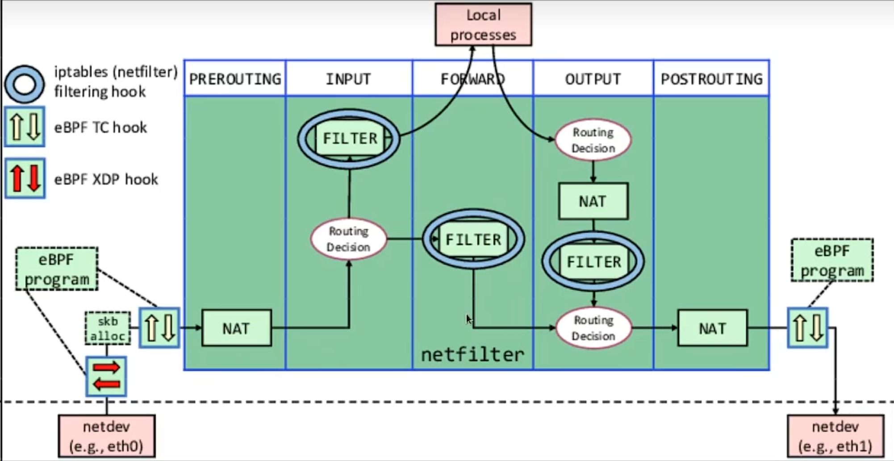
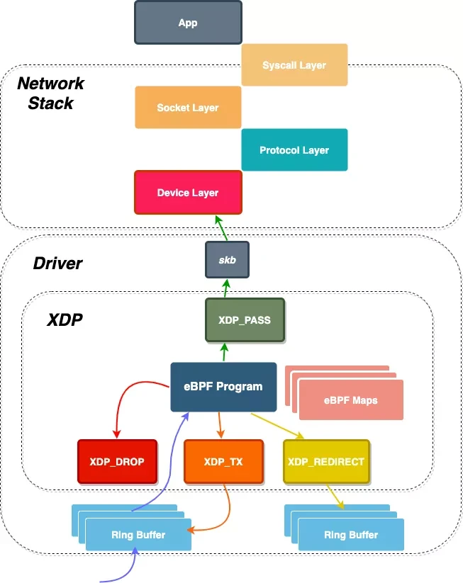
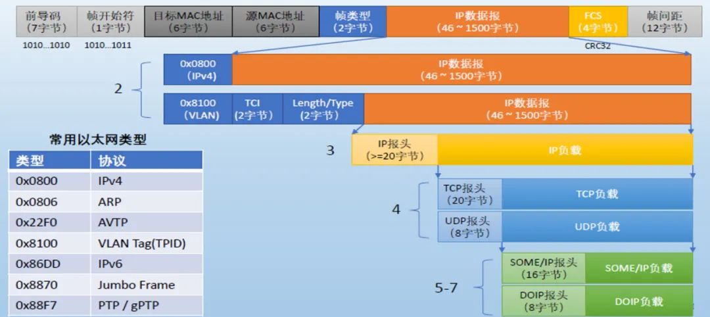

+++

author = "旅店老板"
title = "通过xdp轻松缓解Ddos攻击"
date = "2024-05-06"
description = "缓解ddos攻击通过xdp技术实现"
tags = [
	"ebpf",
    "xdp",
]
categories = [
    "ebpf",
     "xdp",
]
series = [""]
aliases = ["migrate-from-jekyl"]
image = "ebpf-go.png"
mermaid = true
+++
阅读本文之前能对ebpf程序有一定的了解。
## xdp是什么
xdp全称eXpress Data Path，即快速数据路径。是一种ebpf程序的应用，它能够在网络数据包到达网卡驱动层时对其进行处理,在网络协议栈入口处对数据包进行过滤、丢弃、转发。  

xdp程序通常工作在数据链路层(特殊的网卡设备也能运行xdp程序,彻底解放cpu。Netronome智能网卡支持xdp卸载),更早的数据包处理能力能帮助我们实现**高性能的负载均衡器**、**Ddos攻击防护或防火墙**。

   
如上图(图片来源于网络)所示,传统的netfilter过滤数据包在网络协议栈中,对于Ddos攻击抵御效果不佳(数据包分配了skb,也在网络堆栈中运行一定时间占用服务器资源)。  

而xdp程序是在分配skb之前处理数据包。xdp程序处理数据包有特定的返回值,不同的返回值会有不同的逻辑处理。如下图所示:
  
```c
enum xdp_action {
	XDP_ABORTED = 0,
	XDP_DROP,
	XDP_PASS,
	XDP_TX,
	XDP_REDIRECT,
};
```
* **XDP_DROP**：直接丢弃数据包,缓解Ddos攻击通常用这种  


* **XDP_ABORTED**: 丢弃数据包，但会触发一个eBPF程序静态跟踪点，可以调试监控这种非正常行为  


* **XDP_TX**:将处理后的数据包发回相同网卡


* **XDP_REDIRECT**:将包重定向到其他网络接口（包括虚拟机的虚拟网卡），或者通过AF_XDP socket重定向到用户空间。


* **XDP_PASS**:允许报文上送到内核网络栈，同时处理该报文的CPU会分配并填充一个skb，将其传递到内核协议栈

***
## 以太网帧
本节回顾以太网帧的相关知识,为xdp程序开发做一些准备。
```c
SEC("xdp")
int xdp_hello(struct xdp_md *ctx) {
    return XDP_DROP;
}
char LICENSE[] SEC("license") = "Dual BSD/GPL";
```
这是一个最简单的xdp程序,它的逻辑是丢弃所有数据包。xdp_md是xdp程序的上下文，其中的指针指向一个数据包(以太网帧)。  
```c
struct xdp_md {
	__u32 data;
	__u32 data_end;
	__u32 data_meta;
	/* Below access go through struct xdp_rxq_info */
	__u32 ingress_ifindex; /* rxq->dev->ifindex */
	__u32 rx_queue_index;  /* rxq->queue_index  */
};
```
结构体字段是__u32类型的数字,实际是指向以太网帧的指针。

在开发xdp程序之前,回顾一下以太网帧的结构，xdp的核心就是对以太网帧的解析。以太网帧结构如下:
  
前导码和帧开始符是在物理层由网卡添加上的,严格意义上说不算是以太网帧的一部分。
以太网帧由**头部(header)**、**载荷(data)**、**校验和(FCS/CRC)**。头部包含三个字段：①6字节的目标MAC地址，标记数据由哪台机器接收  ②6字节的源MAC地址，标记数据由哪台机器发送
③帧类型，长度为两个字节。
>从上图可知帧类型有IPv4、ARP、VLAN Tag、IPv6等,帧类型指明了网络层由哪个协议处理数据。  
> 
>当数据帧到达网卡时，在物理层上网卡要先去掉前导同步码和帧开始定界符，然后对帧进行CRC检验，如果帧校验和错，就丢弃此帧。校验和为4字节,值为16进制反码求和，相对于md5是很粗糙的计算，因此在网络协议栈每层都会计算自己的校验和。

当帧类型为Ipv4时,载荷就是一个IP数据报。IP数据报由IP报头和IP载荷构成。
***
## xdp程序实现
①初始化一个名为`xdp_parse.c`的文件,内容为：
```c
//go:build ignore
#include <linux/bpf.h>
#include <linux/if_ether.h>
#include <linux/ip.h>
#include <bpf/bpf_helpers.h>
#include <bpf/bpf_endian.h>

SEC("xdp")
int xdp_parse_func(struct xdp_md *ctx) {
    void *data_end = (void *) (long) ctx->data_end;
    void *data = (void *) (long) ctx->data;
    struct ethhdr *eth;
    struct iphdr *iph;
    __u64 nh_off = sizeof(*eth);
    
    return XDP_PASS;
}

char _license[] SEC("license") = "GPL";
```
代码中我们获取了以太网帧的起始`data`和结束地址`data_end`,申明了变量eth,它是指向以太网头部ethhdr的指针,


