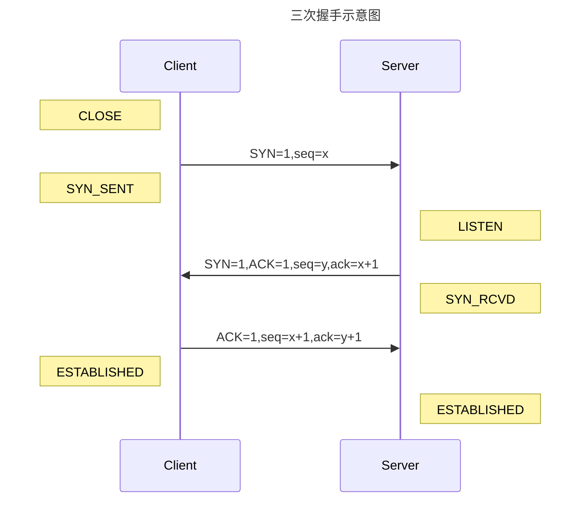
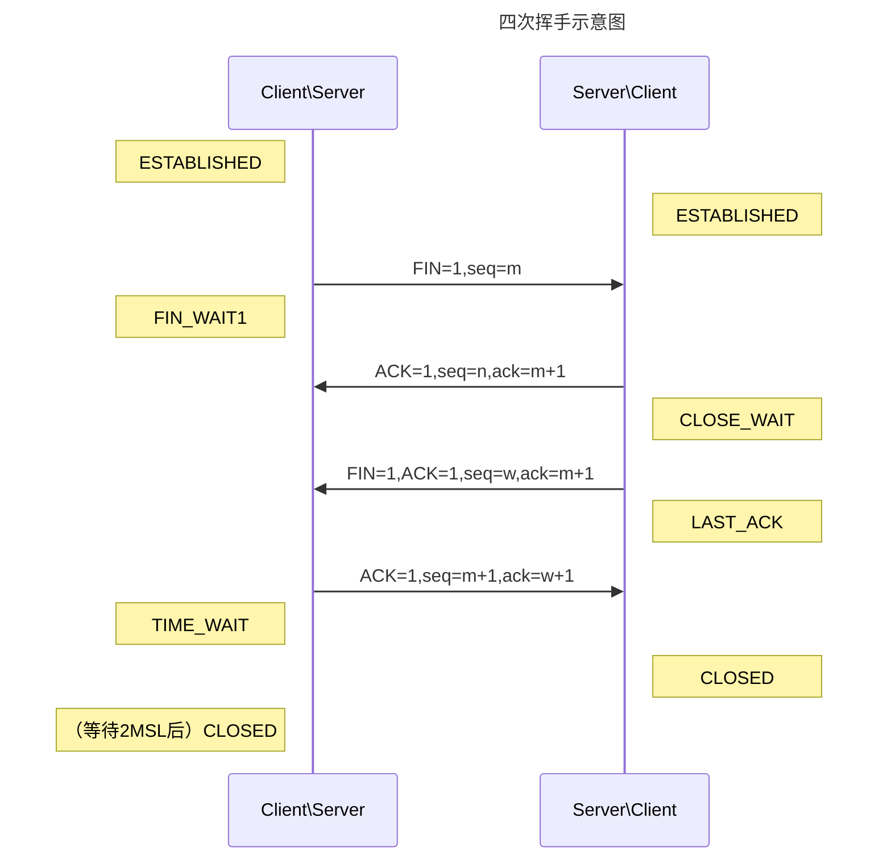

+++

author = "旅店老板"
title = "深入理解tcp协议"
date = "2023-02-14"
description = "深入理解tcp中的专业名词和基本原理"
tags = [
	"tcp",
]
categories = [
    "linux",
]
series = [""]
aliases = ["migrate-from-jekyl"]
image = "tcp.png"
mermaid = true

+++
## 定义
传输控制协议（TCP，Transmission Control Protocol）是一种面向连接的、可靠的、基于字节流的传输层通信协议
* 面向连接：面向连接的协议要求正式发送数据之前需要通过三次握手建立一个逻辑连接，结束通信时也是通过有序的四次挥手来断开连接。
* 基于字节流：TCP是一种字节流协议，没有固定的报文边界，这既是导致**粘包**的原因
* 可靠：对每个包提供校验和、序列号解决了接收数据的乱序、重复问题、超时重传、流量控制、拥塞控制
> **没有固定的报文边界** 是指假设调用2次write()函数往socket里依次写10字节、5字节,最终会以多少条报文发出去是未知的  
> **1**.分为两条报文依次发出去10字节 和5字节数据  
> **2**.两部分数据合并为15字节的一条报文发送  
> **3**.第一部分10字节+第二部分1字节发送，剩余4字节单独发送  
> **......**
> 还有更多可能的排列组合
***
## 名词解释

### SYN
* 同步标志,表示32位序列号栏是否有效。
* 当SYN=1、ACK=0时时表示这是一个连接请求报文段。
* 若同意建立连接，响应报文段中SYN=1、ACK=1，此时表示这是一个连接请求接受报文。
* 所以SYN=1表示32位序列号栏有效，该报文是一个连接请求报文或连接请求接受报文。
### ACK
* 确认标志，当ACK=1时32位确认号栏有效，ACK=0时表示32位确认号无效。
* TCP规定，在TCP连接建立后所有传送的数据报文段ACK都必须设置为1
### URG
* 紧急标志，表示紧急指针域是否有效。
* 紧急数据的起始点=序号，紧急数据的终止点=序号+紧急指针；
### PSH
* 推标志，
### FIN
* 当FIN=1时，表明此报文段的发送方的数据已经发送完毕，并要求释放连接
### RST
* 表示复位标志是否有效。用于复位相应的TCP连接
***
## 三次握手，四次挥手
### 三次握手示意图

### 三次握手过程
* 第一次： 客户端给服务端发一个SYN报文，并指明客户端的初始化序列号seq=x。此时客户端处于**SYN_SENT**状态。
* 第二次： 服务器收到客户端的SYN报文之后，会发送SYN应答报文，并且也是指定了自己的初始化序列号seq=y,同时会把客户端的序列号x+1作为ack的值，
表示自己已经收到了客户端的x+1之前的所有报文，希望下次报文的序列号为x+1，此时服务器处于**SYN_RCVD**状态。
* 第三次： 客户端收到SYN应答报文之后，会发送一个ACK报文，将服务器的序列号y+1作为ack的值，此时客户端处于**ESTABLISHED**状态，服务器收到ACK报文之后，也处于**ESTABLISHED**状态
此时，建立连接成功，可以进行数据传输。
>第一次握手：SYN=1，初始序号seq=x，SYN=1的报文段不能携带数据，但要消耗掉一个序号  
>   
>第三次握手：确认报文段ACK=1，确认号ack=y+1，序号seq=x+1（初始为seq=x，第二个报文段所以要+1），ACK报文段可以携带数据，不携带数据则不消耗序号
***
### 为什么需要三次握手？两次不行吗？

* **为了防止服务器端开启一些无用的连接增加服务器开销**。假如只进行两次握手，服务器第二次握手发出报文后建立连接，此时该报文如果延迟到达或丢失，客户端因超时重新发起建立连接请求。服务器端上一个连接会一直开着，长此以往服务器开销严重浪费。
* **防止已失效的连接请求报文到达服务器端建立连接**。假如只进行两次握手，第一次握手请求连接报文延迟到达服务器端，客户端超时后关闭，服务器端认为是有效请求，应答后建立连接。
***
### 四次挥手示意图
四次挥手服务器和客户端都可以发起，断开连接需要四次挥手的原因是TCP的**半关闭**。半关闭是指TCP连接的一端在结束发送后仍然有接受另一端数据的能力。  
（第二次挥手另一端先回复ACK报文表示收到关闭连接请求，等数据发送完成后再发送FIN报文）
***

***
### 四次挥手过程
假设客户端发起关闭连接请求（发起关闭连接请求前连接双方都处于ESTABLISHED状态），四次挥手过程如下：
* 第一次：客户端发送一个FIN报文，指定序列号seq=m，此时客户端处于**FIN_WAIT1**状态
* 第二次：服务器端收到FIN报文后，后首先发送ACK报文，指定序列号seq=n,确认序号ack=m+1（表示收到m+1序号之前的数据已收到，希望下次收到m+1的报文），
此时服务端处于**CLOSE_WAIT**状态，客户端收到该ACK报文后处于**FIN_WAIT2**状态
* 第三次：如果服务器数据发送完毕，也想断开连接了，发送FIN报文，指定序列号seq=w,确认序号ack=m+1，此时服务器端处于**LAST_ACK**状态
* 第四次：客户端收到FIN报文后，回复一个ACK应答报文的序列号seq=m+1,确认号ack=w+1后，此时处于**TIME_WAIT**状态。此时客户端还未关闭，经过时间2MSL后进入**CLOSED**状态，
服务器端收到FIN报文后进入**CLOSED**状态
***
## 粘包
TCP粘包就是指发送方发送的若干包数据到达接收方时粘成了一包，粘包原因可能是来自发送方，也可能是来自接收方
### 发送方粘包
* TCP默认使用**Nagle算法**，将多次间隔较小、数据量较小的数据，合并成一个数据量大的数据块，然后进行封包，数据太长还会进行拆分发送。这会导致3种粘包的情形发生：
1. 多条数据被合并成一条数据发送
2. 一条长数据被拆分成多条数据发送
3. 一条长数据被拆分的一部分和其他短数据一起发送
> 发送方可以关闭TCP的Nagle算法来处理粘包问题，但会增大网络阻塞的概率，降低TCP的传输效率
> Nagle算法主要做两件事：  
> **1**.只有上一个分组得到确认，才会发送下一个分组（保证一个TCP连接上最多只有一个未被确认的未完成小分组）；  
> **2**.收集多个小分组，在一个确认到来时一起发送。
***
### 接受方粘包
* TCP接收到数据包时，并不会马上交到应用层进行处理，TCP将接收到的数据包保存在接收缓存里接收方收到的数据会保存在缓存中，如果应用层提取数据不够快就会导致缓存中多条数据粘在一起
>接受方在TCP所在层无法处理粘包

### 粘包问题解决
粘包的本质是没有固定的报文边界。一般有三种分包的方式：
* **固定长度的消息**。比如每个消息大小都为100字节，接受方每次读满100字节就认为是一个完整的消息。
* **特殊字符作为边界**。
* **自定义消息结构**。
