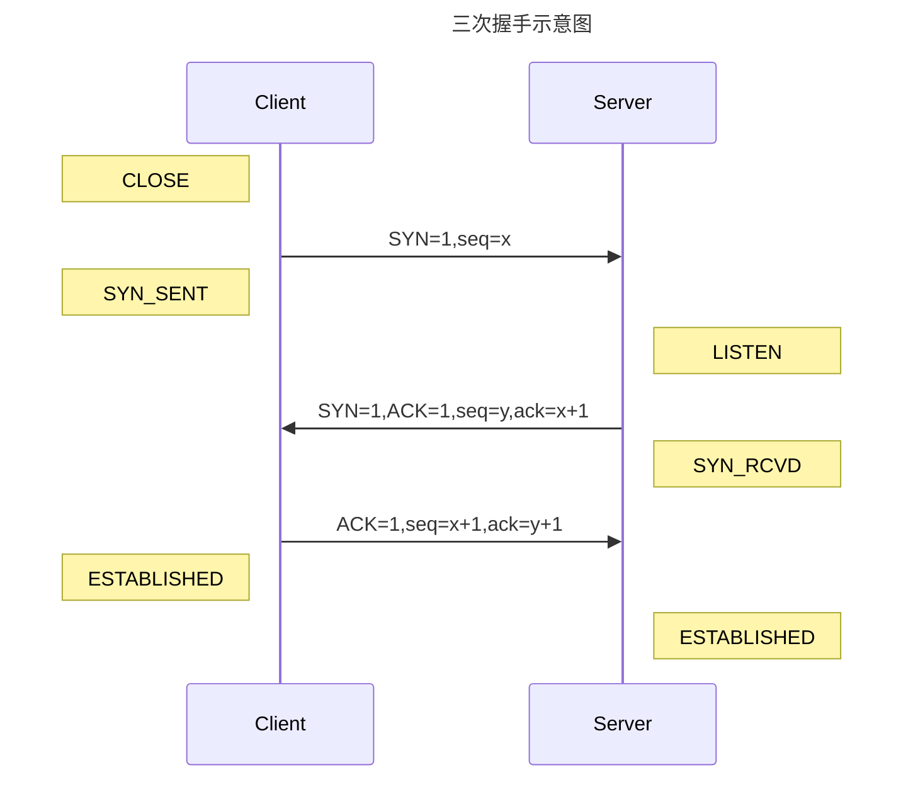

+++

author = "旅店老板"
title = "深入理解tcp协议"
date = "2023-02-14"
description = "深入理解tcp中的专业名词和基本原理"
tags = [
	"tcp",
]
categories = [
    "linux",
]
series = [""]
aliases = ["migrate-from-jekyl"]
image = "tcp.png"
mermaid = true
+++
## 定义
传输控制协议（TCP，Transmission Control Protocol）是一种面向连接的、可靠的、基于字节流的传输层通信协议
* 面向连接：面向连接的协议要求正式发送数据之前需要通过三次握手建立一个逻辑连接，结束通信时也是通过有序的四次挥手来断开连接。
* 可靠：对每个包提供校验和、序列号解决了接收数据的乱序、重复问题、超时重传、流量控制、拥塞控制
* 基于字节流：TCP是一种字节流协议，没有固定的报文边界
> **没有固定的报文边界** 是指假设调用2次write()函数往socket里依次写10字节、5字节,最终会以多少条报文发出去是未知的  
> **1**.分为两条报文依次发出去10字节 和5字节数据  
> **2**.两部分数据合并为15字节的一条报文发送  
> **3**.第一部分10字节+第二部分1字节发送，剩余4字节单独发送  
> **......**
> 还有更多可能的排列组合
***
## 名词解释

### SYN
* 同步标志,表示32位序列号栏是否有效。
* 当SYN=1、ACK=0时时表示这是一个连接请求报文段。
* 若同意建立连接，响应报文段中SYN=1、ACK=1，此时表示这是一个连接请求接受报文。
* 所以SYN=1表示32位序列号栏有效，该报文是一个连接请求报文或连接请求接受报文。
### ACK
* 确认标志，当ACK=1时32位确认号栏有效，ACK=0时表示32位确认号无效。
* TCP规定，在TCP连接建立后所有传送的数据报文段ACK都必须设置为1
### URG
* 紧急标志，表示紧急指针域是否有效。
* 紧急数据的起始点=序号，紧急数据的终止点=序号+紧急指针；
### PSH
* 推标志，
### FIN
* 当FIN=1时，表明此报文段的发送方的数据已经发送完毕，并要求释放连接
### RST
* 表示复位标志是否有效。用于复位相应的TCP连接
***
## 三次握手，四次挥手
### 三次握手流程
***

##### 三次握手过程：
1. 客户端给服务端发一个SYN报文，并指明客户端的初始化序列号seq=x。此时客户端处于**SYN_SENT**状态。
2. 服务器收到客户端的SYN报文之后，会发送SYN应答报文，并且也是指定了自己的初始化序列号seq=y,同时会把客户端的序列号x+1作为ack的值，
表示自己已经收到了客户端的x+1之前的所有报文，希望下次报文的序列号为x+1，此时服务器处于**SYN_RCVD**状态。
3. 客户端收到SYN应答报文之后，会发送一个ACK报文，将服务器的序列号y+1作为ack的值，此时客户端处于**ESTABLISHED**状态，服务器收到ACK报文之后，也处于**ESTABLISHED**状态
此时，建立连接成功，可以进行数据传输。
>第一次握手：SYN=1，初始序号seq=x，SYN=1的报文段不能携带数据，但要消耗掉一个序号  
>   
>第三次握手：确认报文段ACK=1，确认号ack=y+1，序号seq=x+1（初始为seq=x，第二个报文段所以要+1），ACK报文段可以携带数据，不携带数据则不消耗序号
***
### 为什么需要三次握手？两次不行吗？
# 四、粘包，拆包
* TCP粘包就是指发送方发送的若干包数据到达接收方时粘成了一包，粘包原因可能是来自发送方，也可能是来自接收方
* 发送方原因：TCP默认使用**Nagle算法**，将多次间隔较小、数据量较小的数据，合并成一个数据量大的数据块，然后进行封包
* 接收方原因：TCP接收到数据包时，并不会马上交到应用层进行处理，TCP将接收到的数据包保存在接收缓存里接收方收到的数据会保存在缓存中，如果应用层提取数据不够快就会导致缓存中多条数据粘在一起
> Nagle算法主要做两件事：  
> **1**.只有上一个分组得到确认，才会发送下一个分组；  
> **2**.收集多个小分组，在一个确认到来时一起发送。

