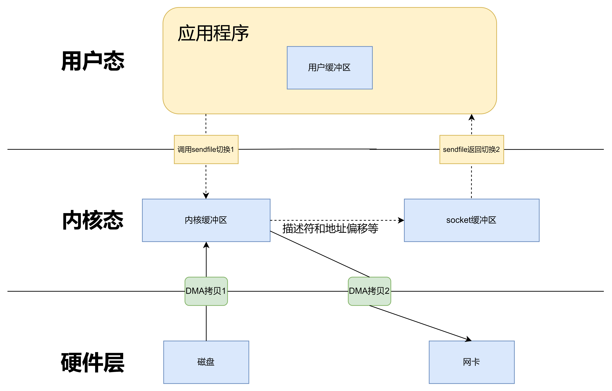

+++

author = "旅店老板"
title = "Zero-Copy"
date = "2022-11-10"
description = "探索零拷贝(zero-copy)技术的产生背景和实现方式"
tags = [
	"linux",
]
categories = [
    "linux",
]
series = [""]
aliases = ["migrate-from-jekyl"]
mermaid = true
+++
# 一、数据拷贝的基本过程

* 数据流向从`磁盘`到`内存`再到`磁盘`,对于web应用服务器,数据到达`内存`后，通过`网卡`发送给用户,两者的区别是向网卡发数据会将数据存在内核的套接字缓存区(skb)
***
## 1.1 仅通过CPU的方式
* 读取数据，调用read()从用户态陷入内核态
* CPU向磁盘发起I/O请求，磁盘控制器收到请求后开始准备数据
* 数据被放到磁盘缓冲区后，发起IO中断,表示数据已准备就绪
* CPU收到中断后开始拷贝数据， `磁盘缓冲区`->`内核缓冲区`->`用户缓冲区`,完成后read()返回,从内核态切换为用户态

***
## 1.2 通过CPU何DMA的方式
CPU的资源非常宝贵,目前大多数系统支持直接内存访问(**Direct Memory Access**)机制,使硬件绕过CPU直接访问内存,解放了CPU，一般磁盘控制器和网卡等硬件设备都支持DMA
* 与仅用CPU的区别就是CPU不再与磁盘交互,而是DMA和磁盘交互

**cpu+dma调用示意图如下：**

***
> **1.无论是仅CPU的方式还是CPU+DMA的方式，都存在多次冗余的数据拷贝及用户态和内核态的切换**  
> **2.read()涉及2次空间切换、2次CPU拷贝(或1次DMA拷贝和1次CPU拷贝)**  
> **3.write()可以看做read()的逆过程，不论是写到磁盘还是网卡，也涉及2次空间切换、2次CPU拷贝(或1次DMA拷贝和1次CPU拷贝)**  
> **总结：对于web服务器而言，读取磁盘的文件发送给用户需要4次空间切换(read()2次、write()2次)、4次拷贝(磁盘缓冲区->内核缓冲区->用户缓冲区->套接字缓冲区->网卡)**
***

# 二、零拷贝技术
## 2.1 背景
如前面所示，如果程序不对数据进行修改，多次数据拷贝及用户态和内核态的切换都是冗余操作，为了降低拷贝次数，这就是Zero-Copy技术
## 2.2 实现方式
零拷贝的实现方式包括: `mmap`、`sendfile`、`sendfile+DMA`、`splice`等
### 2.2.1 mmap+write方式
* mmap是linux提供的一种内存映射文件的机制，实现了将内核缓冲区地址与用户缓冲区地址进行映射，从而达到内核缓冲区和用户缓冲区内存的共享
* mmap减少了一次CPU拷贝，`磁盘缓冲区`->`内核缓冲区(mmap用户缓冲区)`->`套接字缓冲区`->`网卡`
* Kafka 的索引文件使用的是 mmap + write 方式，数据文件使用的是 sendfile 方式  
***
**mmap+write调用示意图如下：** 

**mmap+write方式调用流程如下：**  
1.用户调用mmap()，从用户态陷入内核态，将内核缓冲区映射到用户缓存区  
2.DMA 控制器将数据从硬盘拷贝到内核缓冲区  
3.mmap()返回，上下文从内核态切换回用户态  
4.用户调用write()，尝试把文件数据写到内核里的套接字缓冲区，陷入内核态  
5.CPU将内核缓冲区中的数据拷贝到的套接字缓冲区  
6.DMA控制器将数据从套接字缓冲区拷贝到网卡完成数据传输  
7.write() 返回，上下文从内核态切换回用户态
***
### 2.2.2 sendfile方式
* sendfile是linux 2.1提供的系统调用，它建立了两个文件之间的传输通道
* sendfile减少了一次CPU拷贝，`磁盘缓冲区`->`内核缓冲区`->`套接字缓冲区`->`网卡`,减少了2次空间切换(之前调用read+write 现在只调用sendfile)
* sendfile减少了两次空间切换，之前read()2次、write()2次，现在sendfile()2次
* 该方式数据不经过用户缓冲区，无法修改

**sendfile调用示意图如下：**

***
### 2.2.3 sendfile+DMA方式
* Linux 2.4内核对 sendfile系统调用进行优化，但是需要硬件DMA控制器的配合。
* sendfile优化后可以将内核缓冲区对应的数据信息(文件描述符、地址偏移量等)记录到套接字缓冲区(skb)
* DMA控制器根据套接字缓冲区的地址信息等将数据从内核缓冲区直接拷贝到网卡,在2.2.2的基础上再减少一次CPU拷贝，`磁盘缓冲区`->`内核缓冲区`->`网卡`
* sendfile+DMA方式有2次空间切换、0次CPU拷贝、2次DMA拷贝,数据仍无法修改

**sendfile调用示意图如下：**

***
### 2.2.4 splice方式
* splice()系统调用是Linux 2.6引入的，其不需要硬件支持，并且不再限定于socket上，实现了两个普通文件之间的数据零拷贝。
* splice()系统调用可以在内核缓冲区和socket缓冲区之间建立管道来传输数据，避免了两者之间的CPU拷贝操作。
* splice()系统调用也有一些局限，它的两个文件描述符参数中有一个必须是管道设备
