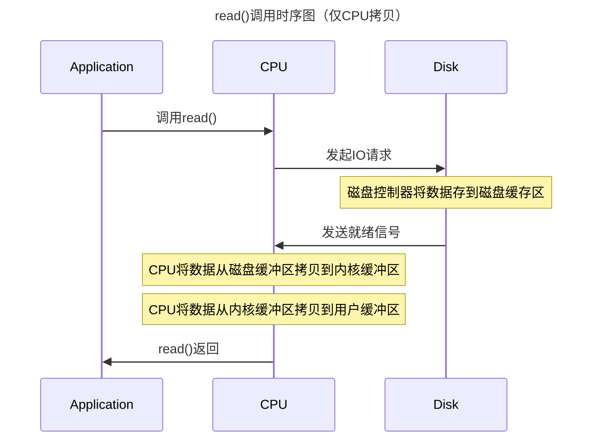
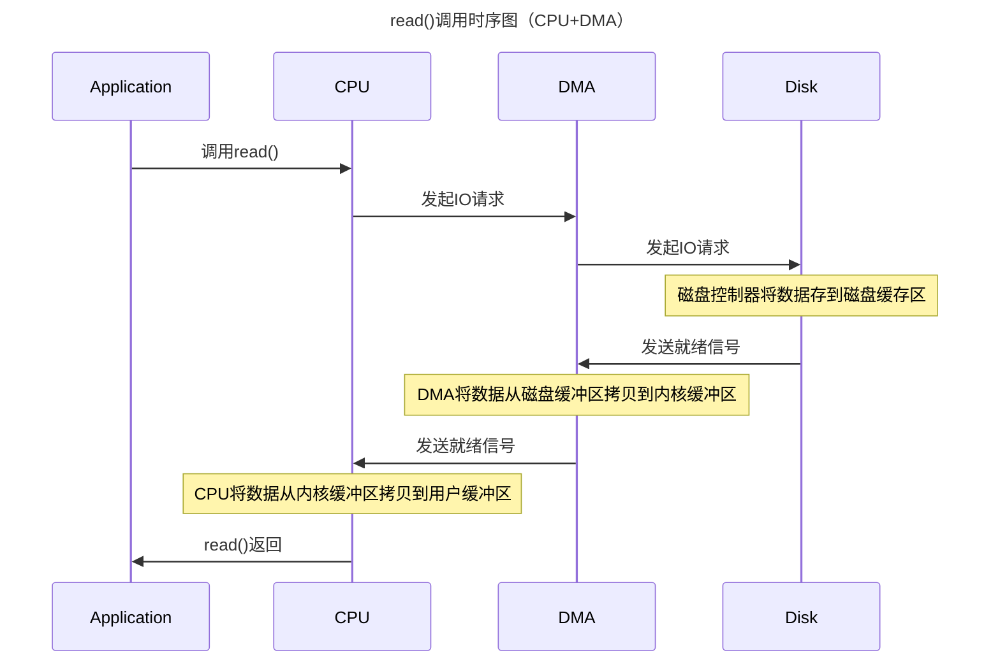

```mermaid
sequenceDiagram
Title: read()调用时序图（仅CPU拷贝）
Application->>CPU: 调用read()  
CPU->>Disk: 发起IO请求
Note over Disk: 磁盘控制器将数据存到磁盘缓存区
Disk->>CPU: 发送就绪信号
Note over CPU: CPU将数据从磁盘缓冲区拷贝到内核缓冲区
Note over CPU: CPU将数据从内核缓冲区拷贝到用户缓冲区
CPU->>Application: read()返回
```
***

```mermaid
sequenceDiagram
Title: read()调用时序图（CPU+DMA）
Application->>CPU: 调用read()
CPU->>DMA: 发起IO请求
DMA->>Disk: 发起IO请求
Note over Disk: 磁盘控制器将数据存到磁盘缓存区
Disk->>DMA: 发送就绪信号
Note over DMA: DMA将数据从磁盘缓冲区拷贝到内核缓冲区
DMA->>CPU: 发送就绪信号
Note over CPU: CPU将数据从内核缓冲区拷贝到用户缓冲区
CPU->>Application: read()返回
```